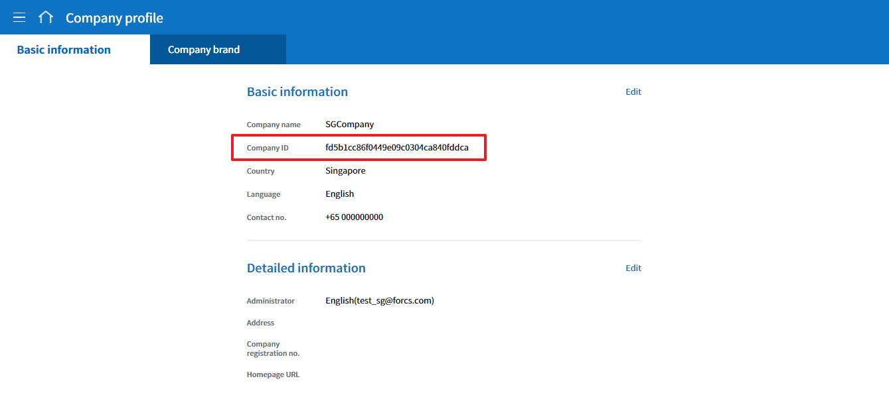
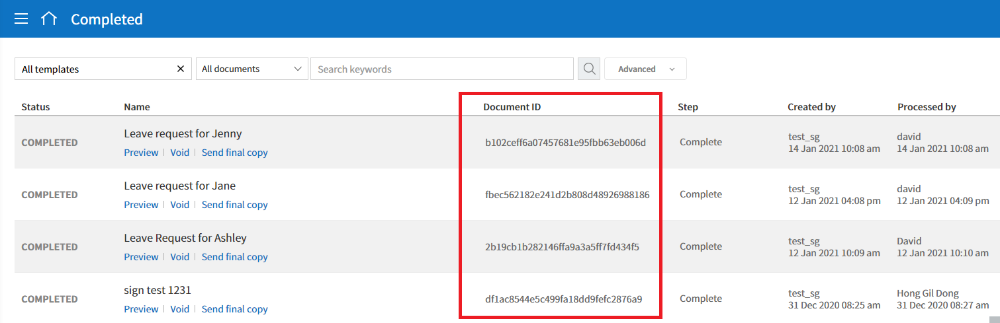
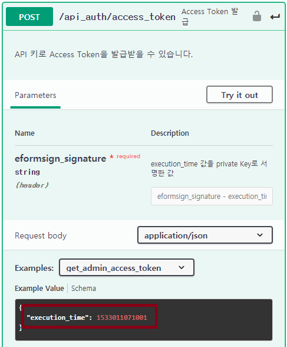
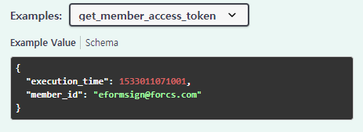

--------------------------
Using eformsign API
--------------------------

The API provided by eformsign allows customers to call and use eformsign features in their system/service.

Getting started 
====================

eformsign API를 사용하기 위해서는 다음의 준비 작업이 필요합니다.

- 회사 ID와 문서 ID 확인하기
- API 키 발급 및 비밀키 확인하기
- 서명 생성하기

.. caution:: 
   
   서명 생성에는 30초의 시간 제한이 있습니다. 30초 이내에 서명을 생성하고 토큰을 발급받아야 합니다. 

회사 ID와 문서 ID 확인하기
---------------------------

eformsign API를 사용하기 위해서는 소속 회사의 ID와 조회하고자 하는 문서의 ID를 알고 있어야 합니다. 

eformsign 서비스에 로그인하여 회사 ID와 문서 ID를 확인해 주십시오.

.. note:: 

   회사 ID는 왼쪽 메뉴 트리의 회사 관리 > 회사 정보 메뉴의 "기본 정보" 탭에서 확인할 수 있습니다.

   |image1|

   문서 ID는 각 문서함 오른쪽 상단의 문서 아이콘(|image2|)을 클릭하여 문서 ID 컬럼을 추가하면 조회하고자 하는 문서의 ID를 확인할 수 있습니다. 

   |image3|

.. _apikey:

Getting an API key and private key
----------------------------------------

1. Log in to eformsign as the company administrator and then go to **[Integration] > [API / Webhook]** in the sidebar menu.

.. image:: resources/apikey1.PNG
    :width: 700
    :alt: Integration > API/Webhook menu

2. Select the **[Manage API key]** tab and then click the **Create an API key** button.

.. image:: resources/apikey2.PNG
    :width: 700
    :alt: Create an API key button

3. Enter the alias and application name in the **Create an API key** pop-up and then click the **Save** button.

.. image:: resources/apikey3.PNG
    :width: 700
    :alt: Create an API key pop-up

4. Click the **View key** button in the list to view the API key and Private key.

.. image:: resources/apikey4.PNG
    :width: 700
    :alt: View key button

.. image:: resources/apikey5.PNG
    :width: 700
    :alt: API key and Private key

.. note:: **Editing an API key**

    You can change the alias and application name by clicking the **Edit** button in the API key list. You can also disable/enable the key by clicking the **Status** toggle button.

.. note:: **Deleting an API key**

    You can delete an API key by clicking the **Delete** button in the API key list.

Generating a signature 
==============================

eformsign_signature uses asymmetric key cryptography and elliptic curve cryptography.

.. tip:: 
   
   Elliptic curve cryptography is a public key encryption method and is currently the most popular method used in data encryption, digital authentication, etc.

The following describes how to generate a signature for each language: Java, Python, and PHP.

Java
-------

Convert the current time of the server to String (UTF-8) and sign using the private key issued to you in `Getting an API Key <#apikey>`__\. Then, convert the signed data into hex string.

.. note:: 

    The signature algorithm used is SHA256withECDSA.

Python
-------

Use the library for key generation in the link below. Install the library using the following command.

.. code:: python

   pip install https://github.com/warner/python-ecdsa/archive/master.zip

PHP
-------

Make sure that the keycheck.inc.php and test.php files in the following examples are located in the same path before proceeding.

Examples
---------------------

The following shows the examples for each language.

.. note:: 

   execution_time은 long 타입을 사용합니다. 따라서, execution_time 입력 시에는 Access Token 발급 시에 확인한 시간 뒤에 L을 넣어 입력합니다.  

.. code-tabs::

    .. code-tab:: java
        :title: Java

        import java.security.KeyFactory;
        import java.security.spec.PKCS8EncodedKeySpec;
        import java.security.PrivateKey;
        import java.security.Signature;
         
        //private key
        String privateKeyHexStr = "the private key(String) issued to you";
        KeyFactory keyFact = KeyFactory.getInstance("EC");
        PKCS8EncodedKeySpec psks8KeySpec = new PKCS8EncodedKeySpec(new BigInteger(privateKeyHexStr,16).toByteArray());
        PrivateKey privateKey = keyFact.generatePrivate(psks8KeySpec);
         
        //execution_time - the current server time
        long execution_time = new Date().getTime();
        String execution_time_str = String.valueOf(execution_time);
         
        //the generated eformsign_signature
        Signature ecdsa = Signature.getInstance("SHA256withECDSA");
        ecdsa.initSign(privateKey);
        ecdsa.update(execution_time_str.getBytes("UTF-8"));
        String eformsign_signature = new BigInteger(ecdsa.sign()).toString(16);
         
         
        //the current time and the signature value at the current time
        System.out.print("execution_time : "+execution_time);
        System.out.print("eformsign_signature : "+eformsign_signature);

    .. code-tab:: python
        :title: Python

        import hashlib
        import binascii
         
        from time import time
        from ecdsa import SigningKey, VerifyingKey, BadSignatureError
        from ecdsa.util import sigencode_der, sigdecode_der
         
        # private key
        privateKeyHex = "the private key(String) issued to you"
        privateKey = SigningKey.from_der(binascii.unhexlify(privateKeyHex))
         
        # execution_time - current server time
        execution_time = int(time() * 1000)
          
        # the generated eformsign_signature
        eformsign_signature = privateKey.sign(execution_time.encode('utf-8'), hashfunc=hashlib.sha256, sigencode=sigencode_der)
          
        # the current time and the signature value at the current time
        print("execution_time : " + execution_time)
        print("eformsign_signature : " + binascii.hexlify(signature).decode('utf-8'))

    .. code-tab:: php
        :title: PHP - keycheck.inc.php

        <?php
        namespace eformsignECDSA;
  
        class PublicKey
        {
          
            function __construct($str)
            {
                $pem_data = base64_encode(hex2bin($str));
                $offset = 0;
                $pem = "-----BEGIN PUBLIC KEY-----\n";
                while ($offset < strlen($pem_data)) {
                    $pem = $pem . substr($pem_data, $offset, 64) . "\n";
                    $offset = $offset + 64;
                }
                $pem = $pem . "-----END PUBLIC KEY-----\n";
                $this->openSslPublicKey = openssl_get_publickey($pem);
            }
        }
        function getNowMillisecond()
        {
          list($microtime,$timestamp) = explode(' ',microtime());
          $time = $timestamp.substr($microtime, 2, 3);
          
          return $time;
        }
         
         
        function Sign($message, $privateKey)
        {
            openssl_sign($message, $signature, $privateKey->openSslPrivateKey, OPENSSL_ALGO_SHA256);
            return $signature;
        }
        ?>

    .. code-tab:: php
        :title: PHP - test.php

        <?php
        require_once __DIR__ . '/keycheck.inc.php';
 
        use eformsignECDSA\PrivateKey;
         
         
        define('PRIVATE_KEY', 'the private key(String)' issued to you);
         
         
        //setting a private key
        $privateKey = new PrivateKey(PRIVATE_KEY);
         
         
        //execution_time - current server time
        $execution_time = eformsignECDSA\getNowMillisecond();
         
         
        //the generated eformsign_signature
        $signature = eformsignECDSA\Sign(execution_time, $privateKey);
         
         
        //the current time and the signature value at the current time
        print 'execution_time : ' . execution_time . PHP_EOL;
        print 'eformsign_signature : ' . bin2hex($signature) . PHP_EOL;
        ?>

Open API list
=================

eformsign API는 서명 생성을 위한 API와 문서 작성 및 처리를 위한 API로 구분되어 있습니다.

API for generating a signature
------------------------------------

서명 생성을 위해 먼저 `Access Token API <https://app.swaggerhub.com/apis/eformsign_api/eformsign_API_2.0/2.0_auth>`_\를 사용해 주십시오. 

``POST``: `/api_auth/access_token <https://app.swaggerhub.com/apis/eformsign_api/eformsign_API_2.0/2.0_auth#/eformsign/post-api_auth-access_token>`_\  Access Token 발급

Access Token API에 대한 자세한 설명은 
`다음 <https://app.swaggerhub.com/apis/eformsign_api/eformsign_API_2.0/2.0_auth>`__\ 에서 확인하실 수 있습니다.

.. caution:: 
   
   서명 생성에는 30초의 시간 제한이 있습니다. 30초 이내에 서명을 생성하고 토큰을 발급받아야 합니다. 
   또한, 서버 상의 시간과 현재 시간이 일치하지 않을 수 있습니다. Access Token API를 호출한 후 수신한 응답 메시지의 "execution_time"을 확인하세요.

   .. code:: JSON

      { "code": "4000002", "ErrorMessage": "The validation time has expired.",     "execution_time": 1611538409405 }

   `다음 <https://app.swaggerhub.com/apis/eformsign_api/eformsign_API_2.0/2.0_auth>`__\ 의 예제 위치에도 "execution_time"을 입력하세요.
   
   |image5| 

   Access Token은 멤버 권한에 대해서도 발급받을 수 있습니다. 멤버에 대한 Access Token을 발급받으려면 다음과 같이 "execution_time" 외에 "member_id"를 함께 입력해 주세요. 
   
   |image6| 

   이후 해당 API를 실행하면 Access Token이 발급되며, 다음과 같은 형태의 응답을 수신할 수 있습니다.

   .. code:: JSON

      { "api_key": { "name": "애플리케이션_", "alias": "테스트용", "company": { "company_id": "dec5418e58694d90a65d6c38e3d226db", "name": "샘플 데모", "api_url": "https://kr-api.eformsign.com" } }, "oauth_token": { "expires_in": 3600, "token_type": "JWT", "refresh_token": "8fd0a3c1-44dc-4a03-96ad-01fa34cd159c", "access_token": "eyJhbGciOiJSUzI1NiJ9.eyJpc3MiOiJlZm9ybXNpZ24uaWFtIiwiY29udGV4dCI6eyJjbGllbnRJZCI6IjY4MDk0ZWVhMjVhZjRhNjI5ZTI4ZGU5Y2ZlYzRlYmZjIiwiY2xpZW50S2V5IjoiZTNiM2IzZTUtMGEzMS00NTE1LWE5NzEtN2M4Y2FlNDI4NzZmIiwibWFuYWdlbWVudElkIjoiMzRhYWI4MDBjMmEwNDQwNThmZDRlZjc5OGFlY2RlY2EiLCJzY29wZXMiOiJzbWFydF9lZm9ybV9zY29wZSIsInR5cGUiOiJ1c2VyIiwidXNlck5hbWUiOiIzMmIzZDRmOC00MjdkLTRjZjQtOTZiYS1mYzAxNjIxNWRkNDciLCJ1c2VySWQiOiJhNTEyNGVkNmU2M2Y0OTMzOGJlOTA0MjVhNjFkYjlmNSIsInJlZnJlc2hUb2tlbiI6IjhmZDBhM2MxLTQ0ZGMtNGEwMy05NmFkLTAxZmEzNGNkMTU5YyJ9LCJjbGFpbSI6eyJjb21wYW55X2lkIjoiZGVjNTQxOGU1ODY5NGQ5MGE2NWQ2YzM4ZTNkMjI2ZGIiLCJhY2Nlc3Nfa2V5IjoiMzJiM2Q0ZjgtNDI3ZC00Y2Y0LTk2YmEtZmMwMTYyMTVkZDQ3In0sImV4cCI6MTYxMTU0MjIzNiwiaWF0IjoxNjExNTM4NjM2fQ.BltoXXBSabjXfpyLsZik9OZTE5XtLqe9lguMmJ_qfwZN1NyoVoxDqA5y1-_TLis7FvvNjfI1eegOroCZDZPFyXRaBxAj0CW8TijVjbhliJBuccHFyKXaJxmo_GMmTHYtxNNB1SUgLeFIrYROnpQndU8J7ZkfPDgYGwh1YSx-5s4" } }

.. caution:: 
   
   발급한 API 키는 `다음 <https://app.swaggerhub.com/apis/eformsign_api/eformsign_API_2.0/2.0_auth>`__\ 의 위치에 있는 **Authorize** 버튼(|image4|)을 눌러 등록하세요. 단, API 키 값에는 **반드시 Base64**\ 로 인코딩한 문자열을 넣어야 합니다. https://www.base64encode.org/ 에 접속하여 발급한 API 키를 넣고 인코딩된 텍스트를 받아 삽입하세요. 

.. note:: 
  
   Access Token API의 **Authorize** 버튼에는 API 키 값을 입력해야 합니다.

문서 작성 및 처리를 위한 API
----------------------------------

서명을 생성한 후에는 다음의 문서 API를 사용해 새 문서를 작성하거나 문서 정보를 조회할 수 있으며, 완료 문서 파일(문서 PDF, 감사추적증명서)  다운로드하거나 문서의 첨부파일을 다운로드할 수 있습니다. 

.. caution:: 

   본 문서 API를 사용하기 위해서는 Access Token을 먼저 발급받아야 합니다. `Access Token API <https://app.swaggerhub.com/apis/eformsign_api/eformsign_API_2.0/2.0_auth>`_\으로 발급 받은 Access Token을 `다음 <https://app.swaggerhub.com/apis/eformsign_api/eformsign_API_2.0/2.0_general>`__\ 의 위치에 있는 **Authorize** 버튼(|image4|)을 눌러 등록하세요. 

.. note:: 
  
   문서 API의 **Authorize** 버튼에는 Access Token 값을 입력해야 합니다. 

현재 제공 중인 `문서 API <https://app.swaggerhub.com/apis/eformsign_api/eformsign_API_2.0/2.0_general>`_\는 다음과 같습니다.

``POST``: `/api_auth/refresh_token <https://app.swaggerhub.com/apis/eformsign_api/eformsign_API_2.0/2.0_general#/eformsign/post-api_auth-refresh_token>`_\  Access Token 갱신

``POST``: `/api/documents <https://app.swaggerhub.com/apis/eformsign_api/eformsign_API_2.0/2.0_general#/eformsign/post-api-documents>`_\  새 문서 작성(내부 수신자)

``POST``: `/api/documents/external <https://app.swaggerhub.com/apis/eformsign_api/eformsign_API_2.0/2.0_general#/eformsign/post-api-documents-external>`_\  새 문서 작성(외부 수신자)

``GET``: `/api/documents/{document_id} <https://app.swaggerhub.com/apis/eformsign_api/eformsign_API_2.0/2.0_general#/eformsign/get-api-documents-DOCUMENT_ID>`_\  문서정보 조회

``GET``: `/api/docuemnts/{document_id}/download_files <https://app.swaggerhub.com/apis/eformsign_api/eformsign_API_2.0/2.0_general#/eformsign/get-api-documents-DOCUMENT_ID-download_files>`_\  문서 파일 다운로드(문서 PDF, 감사추적증명서)

``GET``: `/api/doduments/{document_id}/download_attach_files <https://app.swaggerhub.com/apis/eformsign_api/eformsign_API_2.0/2.0_general#/eformsign/get-api-documents-DOCUMENT_ID-download_attach_files>`_\  문서 첨부 파일 다운로드

각 eformsign 문서 API에 대한 자세한 설명은 
`다음 <https://app.swaggerhub.com/apis/eformsign_api/eformsign_API_2.0/2.0_general>`__\ 에서 확인하실 수 있습니다.

API 관련 정보
===================

API status code
----------------------

The API status code are as follows.

200
'''''''

===========  ===============  ===================================
Code         Description      Remark
===========  ===============  ===================================
200          Success          Success
===========  ===============  ===================================

202
'''''''

===========  ====================  =========================================================================
Code         Description            Remark
===========  ====================  =========================================================================
2020001      Generating a PDF       -When downloading a PDF file, the file is generated asynchronously, 
                                     so it takes additional time to generate the PDF file after saving a document.
                                    -Downloadable when rerequesting within seconds to minutes.
===========  ====================  =========================================================================

400
'''''''

===========  =====================================  =================================================================================
Code         Description                             Remark
===========  =====================================  =================================================================================
4000001      When omitting a required input value    When the API's required input value (header or parameter value) is omitted                        
4000002      Authentication timeout                  When the API authentication request time has expired
4000003      No API key                              When the API key is deleted or incorrectly entered
4000004      No document                             When the document ID is incorrectly entered
===========  =====================================  =================================================================================

403
'''''''

===========  =======================================  ==========================================
Code         Description                               Remark
===========  =======================================  ==========================================
4030002      Access token authentication error         When the access token is incorrect
4030003      Refresh token authentication error        When the refresh token is incorrect
4030004      Signature value authentication failure    When the signature value is incorrect
4030005      Unsupported API                           When calling an unsupported API
===========  =======================================  ==========================================

405
'''''''

===========  =====================  ======================================
Code         Description            Remark
===========  =====================  ======================================
4050001      Unsupported method     When calling an unsupported method
===========  =====================  ======================================

500
'''''''

===================  ===============  ===================================
Code                 Description      Remark
===================  ===============  ===================================
5000001~5000003      Server error     When a server error occurs
===================  ===============  ===================================

Step types
--------------

===========  ===============  ===================================
Type         Code             Description
===========  ===============  ===================================
Start         00               Start step
Complete      01               Complete step
Approval      02               Approval step
External      03               External recipient step
Accept        04               Internal recipient step
===========  ===============  ===================================

User types
--------------

===================  ===============  ===============================================
Type                 Code             Description
===================  ===============  ===============================================
Internal member      01               Whether the user is an internal member or not
External recipient   02               Whether the user is an external user or not
===================  ===============  ===============================================

Status types
--------------

======================  ===============  ======================================================================
Type                     Code             Description
======================  ===============  ======================================================================
doc_tempsave             001              Draft (when a document is saved as a draft by the initial creator)
doc_create               002              Document created
doc_complete             003              Document completed
doc_update               043              Document modified
doc_request_delete       047              Document deletion requested
doc_delete               049              Document deleted
doc_request_revoke       040              Document void requested
doc_revoke               041              Document voided
doc_request_reject       045              Document decline requested
doc_request_approval     010              Document approval requested
doc_accept_approval      012              Document approval request approved
doc_reject_approval      011              Document approval request declined
doc_cancel               013              Document approval request canceled
doc_request_reception    020              Document approval requested to internal recipient
doc_accept_reception     022              Document approval request approved by internal recipient
doc_reject_reception     021              Document approval request declined by internal recipient
doc_request_outsider     030              Document approval requested to external recipient
doc_accept_outsider      032              Document approved request approved by external recipient
doc_reject_outsider      031              Document approval request declined by external recipient
======================  ===============  ======================================================================

Action types
--------------

======================  ===============  =================================================================
Type                     Code             Description
======================  ===============  =================================================================
doc_tempsave             001              Saving a document as a draft
doc_create               002              Creating a document
doc_complete             003              Completing a document
doc_request_approval     010              Requesting a document for approval
doc_reject_approval      011              Declining a document approval request
doc_accept_approval      012              Approving a document approval request
doc_cancel               013              Cancelling a document approval
doc_request_reception    020              Requesting a document to be approved by an internal recipient
doc_reject_reception     021              Requesting a document to be declined by an internal recipient
doc_accept_reception     022              An internal recipient approving a document approval request
doc_accept_tempsave      023              An internal recipient saving a document as a draft
doc_request_outsider     030              Requesting a document approval to an internal recipient
doc_reject_outsider      031              An external recipient declining a document
doc_accept_outsider      032              An external recipient approving a document
doc_rerequest_outsider   033              Rerequesting a document approval to an external recipient
doc_open_outsider        034              An external recipient opening a document
doc_outsider_tempsave    035              An external recipient saving a document as a draft
doc_request_revoke       040              Requesting a document to be voided
doc_refuse_revoke        041              Declining a document void request
doc_revoke               042              Voiding a document
doc_update               043              Correcting a document
doc_cancel_update        044              Cancelling a document correction
doc_request_reject       045              Requesting a document to be declined
doc_refuse_reject        046              Rejecting a document decline request
doc_request_delete       047              Requesting a document to be deleted
doc_refuse_delete        048              Rejecting a document deletion request
doc_delete               049              Deleting a document
doc_complete_send_pdf    050              Sending a PDF file of a completed document
doc_transfer             051              Transferring a document
======================  ===============  =================================================================

.. |image2| image:: resources/column_icon.png

.. |image4| image:: resources/authorize_icon.png

