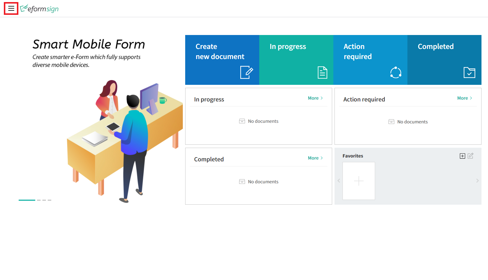
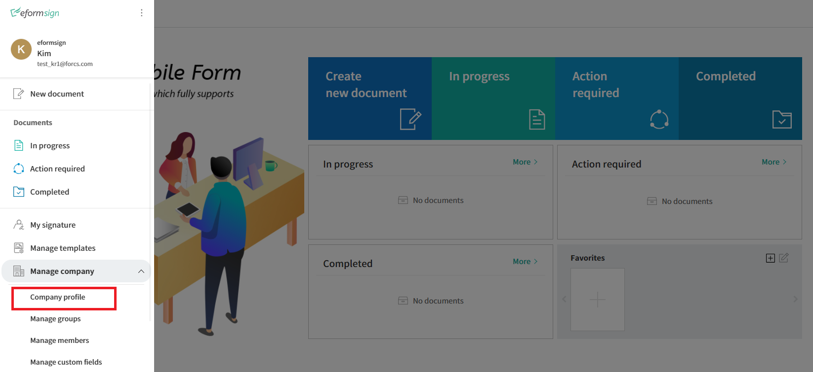
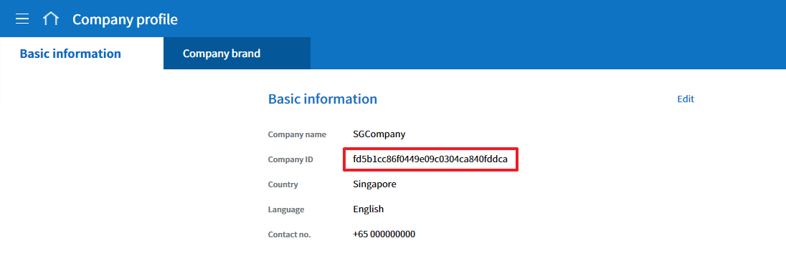
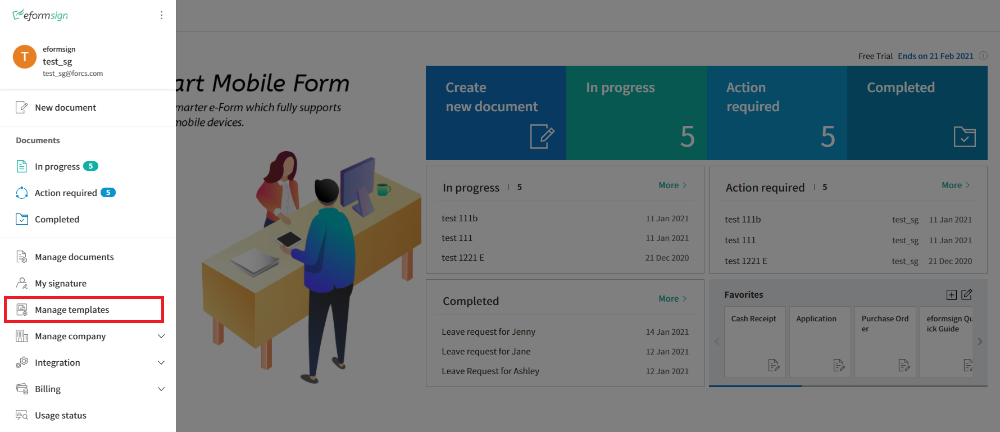
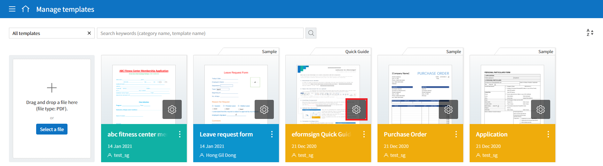
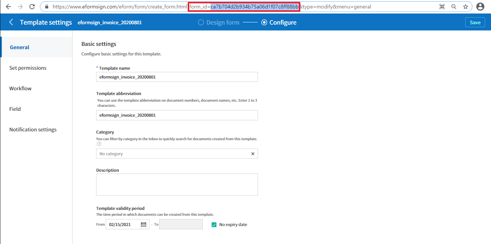

======================================
Embedding eformsign features
======================================

By embedding eformsign features, customers can use eformsign's electronic document features within their service/website without actually visiting the eformsign service.

For example, it's similar to the way of embedding a YouTube video in a blog post so that it can be played on the blog post itself.

-------------------
Getting started
-------------------

You need Company ID and Template ID to use eformsign embedding features.

Where to find Company ID
==============================

You can view the company ID in Manage company > Company profile > Basic information.

eformsign Menu
-------------------------

eformsign Company profile menu
------------------------------------

Company profile > Basic information
---------------------------------------

Where to find Template ID
===============================

Go to Manage templates page and click the Settings icon of the template that you want to use. You can view the form_id in the URL of the template. 

eformsign Manage template menu
------------------------------------

eformsign Manage templates page
-----------------------------------

Template ID 
-----------------------

-------------------
Installation
-------------------

Add the following script in the webpage where you want to use eformsign features.

.. code-block:: Javascript

   //jquery
   <script src="https://www.eformsign.com/plugins/jquery/jquery.min.js"/>
   //eformsign embedded script
   <script src="https://www.eformsign.com/lib/js/efs_embedded_v2.js"/>
   //eformsign redirect script
   <script src="https://www.eformsign.com/lib/js/efs_redirect_v2.js"/>

.. note::

   If you add this script in the page where you want to embed eformsign features, an eformsign object can be used as a global variable.

------------------------------
About the eformsign object
------------------------------

There are two types of eformsign objects: embedded and redirect.

+----------+--------------------+----------------------------------------------+
| Type     | Name               | Description                                  |
+==========+====================+==============================================+
| embedding| eformsign.document | Function that allows to create documents     |
|          | (document_option,  | by embedding eformsign                       |         
|          | iframe_id,         |                                              |
|          | success_callback,  | callback parameters are optional             |
|          | error_callback)    |                                              |
|          |                    | -  document_option, iframe_id: required      |
|          |                    |                                              |
|          |                    | -  success_callback: optional                |
|          |                    |                                              |
|          |                    | -  error_callback: optional                  |
+----------+--------------------+----------------------------------------------+
| redirect | eformsign.document | Function that allows to create documents     |
|          | (document_option)  | by redirecting to eformsign                  |
|          |                    |                                              |
|          |                    | -  document_option : required                |
+----------+--------------------+----------------------------------------------+

.. note::

   The redirect method will be available in the future. 

.. code-block:: javascript

     var eformsign = new EformSign();
     
     var document_option = {
       "company" : {
          "id" : '', // enter the company id
          "country_code" : "", // enter the country code (ex: kr)
          "user_key": ""  // enter the unique key in the customer's system (the unique key of the user who logged in to the customer's system) - optional
       },
       "user" : {
            "type" : "01" ,
            "access_token" : "", // refer to openAPI accessToken for information on entering access tokens
            "refresh_token" : "", // refer to openAPI accessToken for information on entering refresh tokens
            "external_token" : "", // refer to openAPI accessToken for information on entering external tokens used in the external recipient step
            "external_user_info" : {
               "name" : "" // enter the external recipient name in the external recipient step
            }
        },
        "mode" : {
            "type" : "02",
            "template_id" : "", // enter the template id
            "document_id" : ""  // enter the document_id
        },
        "prefill" : {
            "document_name": "", // enter the document title
            "fields": [ {
                "id" ; "customer name",
                "value" : "John Doe",
                "enabled" : true,
                "required" : true 
            }]
        },
        "return_fields" : ['customer name']
     };
     
     //callback option
     var success_callback = function(response){ 
        console.log(response.code); 
        if( response.code == "-1"){
            //successfully created document
            console.log(response.document_id);
            // Can view the data sent to return_fields. The field refers to the ID of the input component generated when filling in a form.
            console.log(response.field_values["company_name"]);
            console.log(response.field_values["position"]);
        }
     };
      
     var error_callback = function(response){
        console.log(response.code); 
        //failed to create document
        alert(response.message);
         
     };
     
     eformsign.document(document_option , "eformsign_iframe" , success_callback , error_callback  );

embedding_document function
====================================

This function allows to create documents in the customer's website/service by embedding eformsign features.

You can use two types of parameters: document_option and callback.

.. note::

   Functions
   document (document_option, iframe_id, success_callback, error_callback)

===================  ===============  =============  =======================================================================================
 Parameter Name      Parameter Type   Required Y/N   Description 
===================  ===============  =============  =======================================================================================
 document_option      Json             Y             Specifies the option related to documents when embedding and running eformsign
 iframe_id            String           Y             The iframe id to be embedded and displayed
 success_callback     function         N             The callback function to be called when an eformsign document is succesfully created
 error_callback       function         N             The callback function to be called when an eformsign document fails to be created
===================  ===============  =============  =======================================================================================

.. code-block:: javascript

     var eformsign = new EformSign();
     var document_option = {
        "company": {
            "id": '', // enter the company id
            "country_code": "", // enter the country code (ex: kr)
            "user_key": '' // enter the unique key in the customer's system (the unique key of the user who logged in to the customer's system) - optional
        },
        "user": {
            "type": "01",
            "access_token": "", // refer to openAPI accessToken for information on entering access tokens
            "refresh_token": "", // refer to openAPI accessToken for information on entering refresh tokens
            "external_token": "", // refer to openAPI accessToken for information on entering external tokens used in the external recipient step
            "external_user_info": {
                "name": "" // enter the external recipient name in the external recipient step
            }
        },
        "mode": {
            "type": "02",
            "template_id": "", // enter the template id
            "document_id": "" // enter the document_id
        },
        "prefill": {
            "document_name": "", // enter the document title
            "fields": [{
                "id" : "",
                "customer name" : "",
                "value": "John doe",
                "enabled": true,
                "required": true
            }]
        },
        "return_fields": ['customer name']
     };
     
     //callback option
     var success_callback = function (response) {
        console.log(response.code);
        if (response.code == "-1") {
            //successfully created document
            console.log(response.document_id);
            // Can view the data sent to return_fields. The field refers to the ID of the input component generated when filling in a form.
            console.log(response.field_values["company_name"]);
            console.log(response.field_values["position"]);
        }
     };
     
     
     var error_callback = function (response) {
        console.log(response.code);
        //failed to create document
        alert(response.message);
     
     };
     
     eformsign.document(document_option, "eformsign_iframe", success_callback, error_callback);

Parameter description: document-option
============================================

In document-option, you can configure settings regarding company information, user information, mode, return fields, and autofill. 

.. note::

   Company information and mode are required fields. 

1. Company information (required)
-----------------------------------------

.. code-block:: javascript

   var document_option = {
     "company" : {
         "id" : 'f9aec832efef4133a1e849efaf8a9aed',  // can be checked in company id - manage company - company profile (required)
         "country_code" : "kr", // Although this is not a required field, it is recommended to be specified. (you can specify the country code in Company profile of Manage company) - allows to open quickly
         "user_key": "eformsign@forcs.com"
     }
 };

2. User information (optional)
-----------------------------------

**Creation of a new document through an internal member logging in**
    - This applies when the user information is not specified.
    - In this case, the eformsign login page is executed and documents can be created after logging in.

**Creation of a document by using the token of an internal member (includes new and received documents).**	
    - When embedded, the token of a specific account is used to create documents and fill in received documents without logging into eformsign.
    - Tokens can be issued through the issuance of Open API's access tokens.

.. code-block:: javascript

    var document_option = {
        "user":{
            "type" : "01" , // 01 - internal or  02 - external  (required)
            "access_token" : "", // refer to openAPI accessToken for information on entering access tokens
            "refresh_token" : "", // refer to openAPI acessToken for information on entering refresh tokens
        }
    };

**Creation of a new document by an external user**  
    - The method of creating a document by a user who is not a member of eformsign

.. code-block:: javascript

    var document_option = {
        "user":{
            "type" : "02" , // 01 - internal or  02 - external  (required)
            "external_user_info" : {
                "name" : "" // enter the external recipient name in the external recipient step
            }
        }
    };

**Creation of a document received from an external user**
    - When eformsign is embedded, this is the method of creating a document received from a user who is not a member of eformsign

.. code-block:: javascript 

    var document_option = {
        "user":{
        "type" : "02" , // 01 - internal or  02 - external  (required)
        "external_token" : "", // refer to openAPI accessToken for information on entering external tokens in the external recipient step
        "external_user_info" : {
        "name" : "" // enter the external recipient name in the external recipient step
            }
        }
    };

.. code-block:: javascript

    var document_option = {
        "user":{
            "type" : "01" , // 01 - internal or  02 - external  (required)
            "access_token" : "", // refer to openAPI accessToken for information on entering access tokens
            "refresh_token" : "", // refer to openAPI accessToken for information on entering refresh tokens
            "external_token" : "", // refer to openAPI accessToken for information on entering external tokens in the external recipient step
            "external_user_info" : {
               "name" : "" // enter the external recipient name in the external recipient step
            }
        }
    };

3. Mode (required)
---------------------

**Creating a new document by using a template** 
    - Create a new document by using a template.

.. code-block:: javascript

    var document_option = {
        "mode" : {
        "type" : "01" ,  // 01 : Create a document, 02 : Fill in a document, 03 : Preview
        "template_id" : "" // enter the template id
        }
    }

**Filling in a received document** 
    - Fill in a received document.	

.. code-block:: javascript

    var document_option = {
        "mode" : {
        "type" : "02" ,  // 01 : Create a document , 02 : Fill in a document, 03 : Preview
        "template_id" : "", // enter the template id
        "document_id" : ""  // enter document_id
        }
    }

**Previewing a document**
    - Preview a document.

.. code-block:: javascript

    var document_option = {
        "mode" : {
        "type" : "03" ,  // 01 : Create a document , 02 : Fill in a document , 03 : Preview
        "template_id" : "", // enter the template id
        "document_id" : ""  // enter document_id
        }
    }

.. code-block:: javascript

    var document_option = {
      "mode" : {
        "type" : "01" ,  //01 : Create a document , 02 : Fill in a document, 03 : Preview
        "template_id" : "", // enter the template id
        "document_id" : ""  // enter document_id
      }
    }

4. Return fields (optional)
--------------------------------

Specify the fields that can be received using callback functions after creating and updating a document.
    
.. note::

   If no field is specified, then only the default fields are provided. Refer to callback parameters for more information.

.. code-block:: javascript

    var document_option = {
       "return_fields" : ['customer name']
    }

5. Auto entry (used for automatically entering fields in the document creation process)
-------------------------------------------------------------------------------------------------------

**Document title**
    - Specify the title of the document to be created in document_name.

.. code-block:: javascript

    var document_option = {
        "prefill" : {
            "document_name": "time off application"
        }
    }

**Field configuration** 
    - Based on the input component ID specified during form creation, set the initial field value, enable/disable option, and required/optional option.

  
.. note::

   - enabled
     - If unspecified, follows the Manage item option in Template settings.
     - If specified, overrides the Manage item option in Template settings.
   - required
     - If unspecified, follows the Manage item option in Template settings.
     - If specified, overrides the Manage item option in Template settings.
   - value
     - If unspecified, follows the Field settings option in Template settings during new document creation.
     - If specified, overrides the Field settings in Template settings.

           
.. code:: javascript
    var document_option = {
        "prefill" : {
        "fields": [ {
            "id" ; "customer name",
            "value" : "John Doe",
            "enabled" : true,
            "required" : true 
        }]
    }
    }

.. code-block:: javascript
    var document_option = {
        "prefill": {
            "document_name": "",
            "fields": [
                {
                    "id": "Customer name",
                    "value": "John Doe",
                "enabled": true,
                    "required": true
                }
            ]
        }
    };

Parameter description: Callback
========================================

==================  ===============  ================   ==========================================================================================
 Parameter Name     Parameter Type   Required (Y/N)      Description        
==================  ===============  ================   ==========================================================================================
 success_callback    function         Y                  The callback function to be called when an eformsign document is created 
 error_callback      function         N                  The callback function to be called when an eformsign document is failed to be created
==================  ===============  ================   ==========================================================================================

The callback functions are configured as follows. 

.. code-block:: javascript
   var eformsign = new eformsign(); // Moves to the iframe document function 
 
   var document_option = {};
 
 
  var sucess_callback= funtion(response){
    console.log(response.document_id);
    console.log(response.title);
    console.log(response.field_values["name"]);
  };
 
 
  var error_callback= funtion(response){
    alert(response.message);
    console.log(response.code); 
    console.log(response.message);
  };
 
 
  eformsign.document(document_option , "eformsign_iframe" , sucess_callback , error_callback);

When a callback function is configured with the document function parameter, the following values are returned when a callback function is called. 

+-----------------+--------+--------------------------------------------------------+-------------------------+
| Callback        | Type   | Description                                            | Remark                  |
+=================+========+========================================================+=========================+
| code            | string | Returns an error code when failed to submit a document |normal if -1             |
+-----------------+--------+--------------------------------------------------------+-------------------------+
| document_id     | string | Returns the document_ID of the created document        | ex) 910b8a965f9         |
|                 |        | when a document is successfully submitted.             | 402b82152f48c6da5a5c    |
+-----------------+--------+--------------------------------------------------------+-------------------------+
| field_values    | object | Can get the value entered by the user                  | ex).field_values["name"]|
|                 |        | in return_fields specified in document_option          | // john                 |
+-----------------+--------+--------------------------------------------------------+-------------------------+
| message         | string | Returns an error message when                          | normal if an empty value|
|                 |        | failed to submit a document                            |                         |
+-----------------+--------+--------------------------------------------------------+-------------------------+
| title           | string | Returns the title of the document                      | ex) contract            |
|                 |        | when a document is submitted                           |                         |
+-----------------+--------+--------------------------------------------------------+-------------------------+

