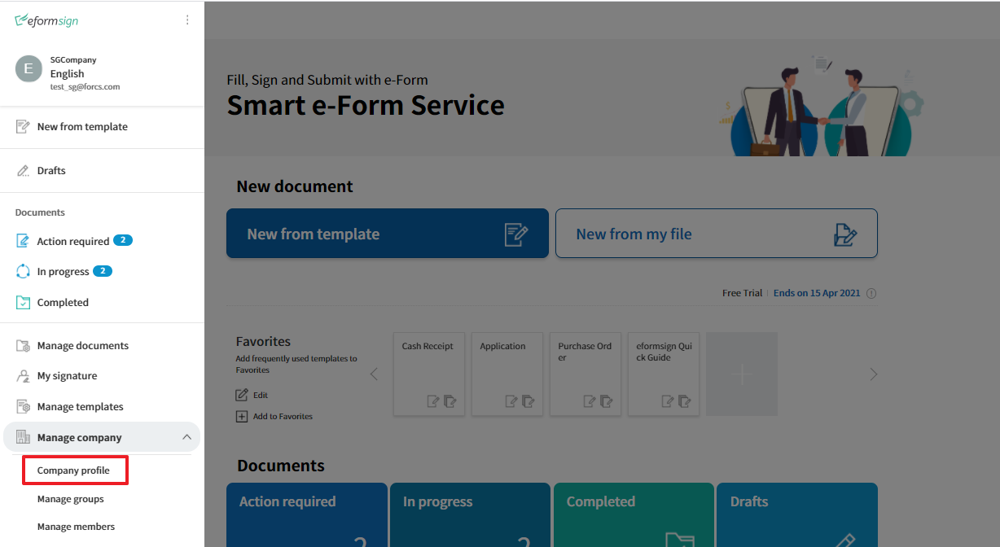
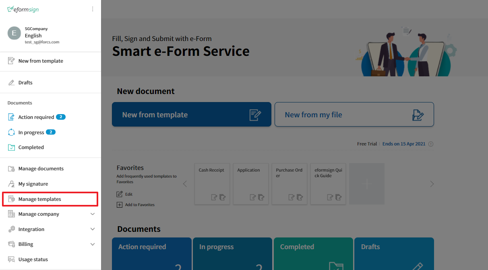

======================================
Embedding eformsign features
======================================

By embedding eformsign features, customers can use eformsign's electronic document features within their service/website without actually visiting the eformsign service.

For example, it's similar to the way of embedding a YouTube video in a blog post so that it can be played on the blog post itself.

--------------------
Getting started
--------------------

Overview
=======================

The following embedding features are supported in eformsign. 

- New from template
- New from my file
- Document processing (filling in, signing, approving, etc.)
- Document previewing
- Template creation
- Template editing
- Template copying

To embed the above features, EformSignDocument and EformSignTemplate objects are provided. Check the features available in these objects and install them accordingly.

eformsign embedding objects
-----------------------------

====================  =========================
Object name           Available features
====================  =========================
EformSignDocument     - New from template

                      - Document processing

                      - Document previewing

EformSignTemplate     - New from my file

                      - Template creation

                      - Template editing

                      - Template duplication
====================  =========================

Installation
========================

Add the following script on the webpage where you want to use eformsign features. 

.. code-block:: javascript

    <!--jQuery-->
    <script src="https://www.eformsign.com/plugins/jquery/jquery.min.js"/>
    <!--EformSignDocument object-->
    <script src="https://www.eformsign.com/lib/js/efs_embedded_v2.js"/>
    <!--EformSignTemplate object-->
    <script src="https://www.eformsign.com/lib/js/efs_embedded_form.js"/>

.. note::

   If you add this script in the page where you want to embed an eformsign feature, an eformsign object can be used as a global variable.
   You can add the script in any location you want (head, body, etc. in the HTML file), but to use the eformsign embedding object, you must first declare it.
   In the case of jQuery, if the script is already added in another method, there is no needed to add it again.

----------------------------------
Setting the embedding option
----------------------------------

When embedding an eformsign feature, you need to set detailed options in JSON for the feature you are embedding.
You can set options such as company info, embedding mode, member info, and pre-filling (auto-fill).

**Feature-specific settings**
=====================================

The eformsign embedding functionality differs depending on what objects you use and what mode you set.

Use the following table to see which object and embedding mode you should use for each feature.

.. note::

   Setting the embedding mode means entering a value in the 'mode' Object under document_option or template_option. Please refer to each feature's page for details on how to set it.

=====================  ===================  =============================================================
Embedding feature      Feature to be used   Embedding mode  
=====================  ===================  =============================================================
New from template       EformSignDocument    "type": "01"
Document processing     EformSignDocument    "type": "02"     
Document previewing     EformSignDocument    "type": "03"    
New from my file        EformSignTemplate    "type": "01", "template_type": "unstructured_form"  
Template creation       EformSignTemplate    "type": "01", "template_type": "form"
Template editing        EformSignTemplate    "type": "02", "template_type": "form"
Template duplication    EformSignTemplate    "type": "03", "template_type": "form"
=====================  ===================  =============================================================

**Check required values**
============================

When setting embedding options, you may need to enter a company ID, template ID, or document ID, depending on the feature you are embedding.

Where to find the Company ID
-------------------------------

You can find the company ID in Manage company > Company profile > Basic information. Note that you must be a company administrator or company manager.

1. Click the **Company profile** menu in the sidebar.

.. image:: resources/Dashboard_menu_icon.png
    :alt: Company profile
    :width: 700px

2. Find the **company ID** in **Company profile > Basic information**.

Where to find the template ID
-------------------------------

Go to the Manage templates page and click the Settings icon of the template that you want to use. You can find the form_id in the URL of the template.

1. Click the **Manage templates** menu in the sidebar.

2. Click the settings button (gear icon) of the template you want in the **Manage templates** page.

.. image:: resources/managetemplate.png
    :alt: Manage templates
    :width: 700px

3. Find the **Template ID(=form_id)**\ in the template URL.

.. image:: resources/templateURL_templateID.png
    :alt: Template ID
    :width: 700px

Where to find the document ID
--------------------------------

You can find the document ID of a document in the inbox where the document is stored.

1. Click the inbox where the document is stored in the sidebar menu.

2. Click the **Select columns** icon (|image1|)\ on the top right corner of the inbox and tick the Document ID check box. This will display the **Document ID** column. Find the document ID of the document you want.

New from template, document processing, and document previewing
=================================================================

This section describes embedding an eformsign feature to create documents from a template (New from template), process received documents, or preview documents.

.. code-block:: javascript

    var eformsign = new EformSignDocument();
 
    var document_option = {
       "company" : {
          "id" : "",            // Enter the company ID
          "country_code" : "",  // Enter the country code (E.g. us)
          "user_key": ""        // The unique key of the user logged in to the system of the customer in which the feature is embedded. Compare browser cookies to the eformsign login information.
       },
       "user" : {
            "type" : "01" ,         // User type (01: member, 02: non-member)
            "id": "test1@forcs.com" // User ID (email)
            "access_token" : "",    // Enter the access token (refer to the section about getting an access token in the Using eformsign API guide)
            "refresh_token" : "",   // Enter the refresh token (refer to the section about getting an access token in the Using eformsign API guide))
            "external_token" : "",  // Enter the external token to authenticate users when processing non-member documents (provided in Webhook)
            "external_user_info" : {
               "name" : ""          // Enter the non-member name when processing non-member documents
            }
        },
        "mode" : {
            "type" : "02",      // Mode (01: Create a new document, 02: Process a document, 03: Preview a document)
            "template_id" : "", // Enter the template id
            "document_id" : ""  // Enter the document_id
        },
        "layout" : {
            "lang_code" : "ko" // Supported languages. ko, en, ja
        },
        "prefill" : {
            "document_name": "", // Enter the document title
            "fields": [
                {
                    "id" ; "customer name",       // Field name
                    "value" : "John Doe",    // Field value
                    "enabled" : true,   // Enabled or not
                    "required" : true   // Required or not
                }
            ],
            "recipients": [
                {
                    "step_idx" : "2",       // Workflow order. Starts from 2 when there is a recipient step in the workflow
                    "step_type": "06",      // Step type. 05: participant, 06: reviewer
                    "name" : 'Jane Doe',        // Recipient name
                    "id": "test@forcs.com", // Recipient ID/email
                    "sms": "01023456789",   // Recipient mobile number
                    "use_mail": true,       // Whether to use email notification
                    "use_sms": true,        // Whether to use SMS notification
                    "auth": {
                        "password": "",     // Enter the password if the Require document password option is selected under Identity verification in a recipient step of the workflow
                        "password_hint": "",// Password hint if the password is entered according to the above condition
                        "valid": {
                            "day": 7,       // Document expiration (days)
                            "hour": 0       // Document expriation (hours)
                        }
                    }
                }
            ],
            "comment": "Enter comments here"     // Comment
        },
        "return_fields" : ['customer name']           // Name of the field to pass in so that the value can be checked in the Success Callback
    };
     
    //callback option
    var success_callback = function(response){ 
        console.log(response.code); 
        if( response.code == "-1"){
            //Successfully created a document
            console.log(response.document_id);
            // Data passed to return_fields can be retrieved. Fields means the ID of the input field you added when you created the form.
            console.log(response.field_values["company_name"]);
            console.log(response.field_values["position"]);
        }
    };
     
    var error_callback = function(response){
        console.log(response.code); 
        //Failed to create a document
        alert(response.message);
    };
     
     
    var action_callback = function (response) {
        console.table(response.data);
    };
     
    eformsign.document(document_option, "eformsign_iframe", success_callback, error_callback, action_callback);
    eformsign.open();

document_option
-------------------------------

The JSON for setting options has the following structure.

===============  ===================   ============  ==========    ================================================================================
 Parameter name    Description          Data type     Required      Sub options
===============  ===================   ============  ==========    ================================================================================
 company          Company info         Object        O             id, country_code, user_key
 mode             Embedding mode       Object        O             type, template_id, document_id
 user             User info            Object        X             type, id, access_token, refresh_token, external_token, external_user_info
 layout           Layout               Object        X             lang_code
 prefill          Prefill              Object        X             document_name, fields, recipients, comment
 return_fields    Return field         Array         X     
===============  ===================   ============  ==========    ================================================================================

.. note::

   Entering the values for company info and mode are required. 

1. Company (company info, required)
~~~~~~~~~~~~~~~~~~~~~~~~~~~~~~~~~~~~~~~~

===============  ==========================  =============  =========  ===============================================================================================================================================================================================================================================================================================
Parameter name    Description                 Data type      Required    Remarks 
===============  ==========================  =============  =========  ===============================================================================================================================================================================================================================================================================================
id               Company ID                  String          O          Find it in Manage company - Company profile
country_code     Country code                String          X          The country code of the country in Company Profile - Basic information. Not required but allows for quick opening if entered.
user_key         User's unique key           String          X          User account information that is passed to eformsign to clarify who the user is in the customer's system that you are embedding. If the browser already has login information, it will be checked against the corresponding key and if it doesn't match, you will be logged out.
===============  ==========================  =============  =========  ===============================================================================================================================================================================================================================================================================================

.. code-block:: javascript

   var document_option = {
         "company" : {
             "id" : 'f9aec832efef4133a1e849efaf8a9aed',
             "country_code" : "kr",
             "user_key": "eformsign@forcs.com"
         }
    };

2. Mode (embedding mode, required)
~~~~~~~~~~~~~~~~~~~~~~~~~~~~~~~~~~~~~~~~

===============  ===============  ===========  ========   ========================================================
Parameter name     Description     Data type   Required   Remark 
===============  ===============  ===========  ========   ========================================================
 type             Feature type     String        O         01: Create document, 02: Process document, 03: Preview
 template_id      Template ID      String        O      
 document_id      Document ID      String        X         Required when Processing or previewing documents
===============  ===============  ===========  ========   ========================================================

**Creating a new document from a template** 

Use a template to create a new document.

.. code-block:: javascript

    var document_option = {
       "mode" : {
        "type" : "01" ,  // 01 : Document creation , 02 : Document processing , 03 : Preview
        "template_id" : "a2c6ed9df9b642f2ade43c7efe58c9a3" // enter the template id
      }
    }

**Filling in a document using a received document** 

Fill in a document using a received document.

.. code-block:: javascript

    var document_option = {
       "mode" : {
        "type" : "02" ,  // 01 : Create document , 02 : Process document , 03 : Preview
        "template_id" : "a2c6ed9df9b642f2ade43c7efe58c9a3", // enter the template id
        "document_id" : "5c19ff8c703f401c968236837d701e92"  // enter the document_id
      }
    }

**Previewing a document**

Preview created documents.

.. code-block:: javascript

    var document_option = {
       "mode" : {
        "type" : "03" ,  // 01 : Create document , 02 : Process document , 03 : Preview
        "template_id" : "a2c6ed9df9b642f2ade43c7efe58c9a3", // enter the template id
        "document_id" : "5c19ff8c703f401c968236837d701e92"  // enter document_id
      }
    }

3. User (user info/optional)
~~~~~~~~~~~~~~~~~~~~~~~~~~~~~~~~~~~~~~~~

=========================  ===================  =============  =========== ===============================================================================================================================================================
 Parameter Name               Description         Data type      Required     Remark 
=========================  ===================  =============  =========== ===============================================================================================================================================================
 type                       User type             String         O         01: Member, 02: Non-member
 id                         Account (email)       String         X         User ID/input email
 access_token               Access token          String         X         For reference go to Open API > `Get access token <https://eformsignen.github.io/developers/help/eformsign_api_en.html#api-for-generating-a-signature>`_
 refresh_token              Refresh token         String         X         For reference go toOpen API > `Get access token <https://eformsignen.github.io/developers/help/eformsign_api_en.html#api-for-generating-a-signature>`_
 external_token             Non-member token      String         X         Required when a non-member processes a document they received (provided in `Webhook <https://eformsignen.github.io/developers/help/eformsign_webhook_en.html>`_)
 external_user_info         Non-member info       Object         X         Required when a non-member creates or processes a document
 external_user_info.name    Non-member name       String         X         Required when a non-member creates or processes a document
=========================  ===================  =============  =========== ===============================================================================================================================================================

**Creating or processing a document via member login**

This is applicable to situations where user information is not specified.
In this case, documents can be created after the eformsign login page is started.

**Creating or processing a document via member login (Pre-populate IDs)**   

When embedded, documents can be created after the eformsign login is started and the member logs in. Here, the ID is pre-populated in the login screen.

.. code-block:: javascript

    var document_option = {
        "user":{
            "type" : "01",
            "id" : "eformsign@forcs.com"
        }
    };

**Creating or processing a document via member token**   

When embedded, the token of an account is used to create documents or process (fill in) received documents, without eformsign login. For information on getting a token, refer to using eformsign API - `Get access token <https://app.swaggerhub.com/apis-docs/eformsign_api.en/eformsign_API_2.0/2.0#/token/post-api_auth-access_token>`_.

.. code-block:: javascript

    var document_option = {
        "user":{
            "type" : "01",
            "id" : "eformsign@forcs.com",
            "access_token" : "eyJhbGciOiJSUzI1NiJ9.eyJpc3MiOiJlZ...",
            "refresh_token" : "0161ac6c-0f47-4cc3-9301-381f57c41495"
        }
    };

**Non-members creating new documents**  

This is for non-members creating documents.
.. code-block:: javascript

    var document_option = {
        "user":{
            "type" : "02",
            "external_user_info" : {
               "name" : "John Doe"
            }
        }
    };

**Non-members processing (filling in) documents they received**

When embedded, this is for non-members to fill in documents they received.
.. code-block:: javascript 

    var document_option = {
        "user":{
            "type" : "02",
            "external_token" : "f8e2ff29114445dcac1e2889ac2f8a5e",
            "external_user_info" : {
                "name" : "John Doe"
            }
        }
    };

4. Layout (optional)
~~~~~~~~~~~~~~~~~~~~~~~~~~~~~~~~~~~~~~~~

===============  ===============================  ===========  =========  ================================================================================================================
Parameter name       Description                   Data type    Required    Remark 
===============  ===============================  ===========  =========  ================================================================================================================
lang_code         Language used in eformsign      String        X         ko: Korean, en: English, ja: Japanese
header            Whether to show the header      Boolean       X         Default when not entered: true

                                                                          If the header is not shown(false), features such as 'Send' are not shown, so a separate button must be created

                                                                          (Refer to `Creating an action button when the screen loads <#creating-button>`_

footer            Whether to show the footer      Boolean       X         Default when not entered: true 
===============  ===============================  ===========  =========  ================================================================================================================

.. code-block:: javascript

    var document_option = {
        "layout" : {
              "lang_code" : "ko",
              "header" : false,
              "footer" : true
        }
    }

5. Prefill (optional)
~~~~~~~~~~~~~~~~~~~~~~~~~~~~~~~~~~~~~~~~

Used to prefill fields when filling in a document.

.. note::

   Does not work when mode.type "03" (document preview).

=================================  =============================  ============  ========  ====================================================================================================================================================================================================
Parameter name                      Description                    Data type     Required  Remark 
=================================  =============================  ============  ========  ====================================================================================================================================================================================================
document_name                      Document title                 String         X   
fields                             Field list                     Array          X        Fields settings object list
fields[].id                        Field name                     String         X        Required in the field settings object (apply settings based on the field name)
fields[].value                     Field name                     String         X        If not specified, follows the field settings option in the template settings when creating a new one. If set, takes priority over the template settings field settings                                                                                      
fields[].enabled                   Whether the field is enabled   Boolean        X        If not specified, follows the template settings Who can fill this out. If set, takes priority over template settings Who can fill this out                                                                                 
fields[].required                  Whether the field is required  Boolean        X        If not specified, follows the template settings Who can fill this out. If set, takes priority over template settings Who can fill this out
recipients                         Recipient list                 Array          X        The recipient info object list
recipients[].step_idx              Workflow order                 String         X        Required to be set in each object in recipients. First recipient: "2", Second recipient and after: Increment by 1 according to the order
recipients[].step_type             Workflow recipient type        String         X        Required to be set in each object in recipients. Legacy workflow: "01"(Complete), "02"(Approver), "03"(External), "04"(internal); New workflow: "01"(Complete), "05"(Participant), "06"(Reviewer)
recipients[].recipient_type        Recipient type                 String         X        Required only when step_type is 02(Approver), 03(External), 04(Internal); "01": when the recipient is a member, "02": when the recipient is a non-member
recipients[].name                  Recipient name                 String         X 
recipients[].id                    Account (email)                String         X        Enter the member account info (ID/email); if the step type is 05(Participant) or 06(Reviewer), can enter the email address regardless of whether a member or not
recipients[].email                 Email address                  String         X        Only use when step_type is 03(External); Enter the external recipient's email address
recipients[].sms                   Mobile number                  String         X   
recipients[].use_mail              Whether to send email          Boolean        X        Only use when step_type is 05(Participant) or 06(Reviewer)
recipients[].use_sms               Whether to send SMS            Boolean        X        Only use when step_type is 05(Participant) or 06(Reviewer)
recipients[].auth                  Identity verification info     Object         X   
                                   and document expiration
recipients[].auth.password         Identity verification (PW)     String         X        Set identity verification before opening documents in the workflow settings; enter the password if the document password is set
recipients[].auth.password_hint    Password hint                  String         X        Password hint if the password is entered according to the above condition
recipients[].auth.valid            Document expiration info       Object         X        Default is not entered: 0 date 0 hour (unlimited for members, need to re-enter on the screen for external recipients)
recipients[].auth.valid.day        Document expiration (days)     Integer        X   
recipients[].auth.valid.hour       Document expiration (time)     Integer        X   
comment                            Message for the recipient      String         X   
=================================  =============================  ============  ========  ====================================================================================================================================================================================================

.. code-block:: javascript

    var document_option = {
        "prefill" : {
            "document_name": "Data Use Agreement",   // Enter the document title
            "fields": [
                {
                    "id" ; "Customer name",       // Field name
                    "value" : "John Doe",    // Field name
                    "enabled" : true,   // Enabled or not
                    "required" : true   // Required or not
                }
            ],
            "recipients": [
                {
                    "step_idx" : "2",       // Workflow order. starts from 2 when there is a recipient
                    "step_type": "06",      // Workflow recipient type. 05: Participant, 06: Reviewer
                    "name" : "John Doe",        // Recipient name
                    "id": "test@forcs.com", // Recipient ID/email
                    "sms": "01023456789",   // Recipient mobile number
                    "use_mail": true,       // Whether to use email notification
                    "use_sms": true,        // Whether to use SMS notification
                    "auth": {
                        "password": "6789", // Set identify verification before opening documents in workflow settings - enter the password if the check box is ticked
                        "password_hint": "Enter the last digits of the mobile number.", // The password hint if the password is entered according to the above condition
                        "valid": {
                            "day": 7,       // Document expiration (days)
                            "hour": 0       // Document expiration (time)
                        }
                    }
                }
            ],
            "comment": "Please review and sign."  //
        }
    };

6. return_fields (optional)
~~~~~~~~~~~~~~~~~~~~~~~~~~~~~~~~~~~~~~~~

Specifies what to pass in the response for the contents of the field that the user created after creating and editing a document.
Enter the field name in the "return_fields" array in the string format.
    
.. note::

   Only provides the basic field if not specified. For related information, refer to  `On success or failure <#success-fail>`_.

.. note::

    Doesn't work when mode.type "03"(during document preview).

.. code-block:: javascript

    var document_option = {
       "return_fields" : ['Customer name']
    }

New from my file
===========================================

You can use the New from my file feature by embedding eformsign.

.. code-block:: javascript

    var eformsign = new EformSignTemplate();
     
    var template_option = {
       "company" : {
          "id" : "76440d70fae242e09c4b0fac40b6a6be",            // Enter the Company ID
          "country_code" : "kr",    // Enter the country code E.g. kr
          "user_key": ""        // The unique key of the user logged into the customer's system in which eformsign is embedded. Compare browser cookies to eformsign login information.
       },
       "user" : {
            "id": "test1@forcs.com"
            "access_token" : "",    // Enter the access token (refer to the OpenAPI access token)
            "refresh_token" : "",   // Enter the refresh token (refer to the OpenAPI access token)
        },
        "mode" : {
            "type" : "01",      // 01 : Create
            "template_id" : "", // Enter the template id
            "template_type": "unstructured_form"    // form : Manage templates, unstructured_form: New from my file
        },
        "layout" : {
            "lang_code" : "ko", // eforsign language. ko, en, ja
            "header" : true,    // Whether to display the header (blue). If not, then actions such as sending can be performed by using an action button.
            "footer" : true     // Whether to display the footer (eformsign logo, language settings).
        },
        "prefill": {
            "template_name": "Template embedding test_new",
            "fields": [
                {
                    "id": "Text 1",
                    "value": "ABC",
                    "enabled": true,
                    "required": true
                },
                {
                    "id": "Text 2",
                    "value": "DEF",
                    "enabled": true,
                    "required": true
                }
            ],
            "step_settings": [
                {
                    "step_type": "05", // 05: Participant, 06: Reviewer
                    "step_name": "Participant 2",
                    "use_mail": true,
                    "use_sms": true,
                    "use_alimtalk" : true,
                    "recipients" : [
                        {
                            "id": "test2@forcs.com",
                            "name" : 'John Doe'
                        },
                        {
                            "id" : "5a3e47a2f5a04909836ddf4189d10fc4",
                            "name" : 'Group 3'
                        }
                    ],
                    "auth": {
                        "valid": {
                            "day": '7',
                            "hour": '7'
                        }
                    },
                    "additional_auth" : {  // Additional verification method
                        use_pincode : true, //Email/SMS pincode verification
                        use_pincode_result : true, //Use email or SMS pincode verification when a document is completed
                        use_mobile_verifyAuth : true, //Mobile verification (available in Korea only)
                        use_mobile_verifyAuth_result : true //Use mobile verification when a document is completed (available in Korea only)
                    }
                }
            ],
            "is_form_id_numbering" : false,
            "disabled_form_id" : true,
            "quick_processing" : false
        },
        "template_file": {
            "name": "test.pdf",
            "mime": "@file/octet-stream",
            "data": "JVBERi0xLjUNCiW1tbW1DQoxIDAgb2JqDQo8PC9UeXBlL0NhdGFsb2cvUGFnZXMgMiAwIFIvTGFuZyhrby1LUikgL1N0cnVjdFRyZWVSb290IDE1IDAgUi..."
        }
    };
     
    //callback option
    var sucess_callback = function (response) {
        if (response.type ==='template'){
            console.log(response.template_id);
            console.log(response.template_name);
            console.table(response.step_settings);
            if ("-1" == response.code) {
                alert("A template was created.\n" + "- document_id : " + response.template_id + "\n- title : " + response.template_name);
            } else {
                alert("Failed to create a template.\n" + "- code : " + response.code + "\n- message : " + response.message);
            }
        }
        window.close();
    };
     
     
    var error_callback = function (response) {
        alert("Failed to create a template.\n" + "- code : " + response.code + "\n- message : " + response.message);
        console.log(response.code);
        console.log(response.message);
        window.close();
    };
     
    var action_callback = function (response) {
        console.table(response.data);
    };
     
    eformsign.template(template_option, "eformsign_iframe", success_callback, error_callback, action_callback);
    eformsign.open();

template_option
-------------------------------

The JSON for setting options has the following structure.

===============  ===============  ============  ========  ================================================================================
Parameter name    Description       Data type   Required  Sub options
===============  ===============  ============  ========  ================================================================================
 company          Company info     Object        O        id, country_code, user_key
 mode             Embedding mode   Object        O        type, template_id, document_id
 user             User info        Object        X        type, id, access_token, refresh_token, external_token, external_user_info
 layout           Layout           Object        X        lang_code
 prefill          Prefill          Object        X        document_name, fields, recipients, comment
 template_file    Template file    Object        X        name, mime, data
===============  ===============  ============  ========  ================================================================================

.. note::

   'company' and 'mode' are required items.

1. Company (company info, required)
~~~~~~~~~~~~~~~~~~~~~~~~~~~~~~~~~~~~~~

===============  ==========================  =============  ========  =================================================================================================================
 Parameter name    Description                 Data type    Required     Note 
===============  ==========================  =============  ========  =================================================================================================================
 id               Company ID                      String         O    Manage company - View in Company profile
 country_code     Country code                    String         X    Manage company - Specify the country code in Company profile. This is optional.
 user_key         User unique key                 String         X    User account information you pass to eformsign to specify who the user is in the customer's system.
===============  ==========================  =============  ========  =================================================================================================================

.. code-block:: javascript

    var template_option= {
         "company" : {
             "id" : 'f9aec832efef4133a1e849efaf8a9aed',
             "country_code" : "kr",
             "user_key": "eformsign@forcs.com"
         }
    };

2. Parameter name (embedding mode, required)
~~~~~~~~~~~~~~~~~~~~~~~~~~~~~~~~~~~~~~~~

===============  ===============  ===========  ========  ==================================================
 Parameter name    Description      Data type  Required    Remark
===============  ===============  ===========  ========  ==================================================
 type             Feature type      String        O        01: Create
 template_type    Embedding type    String        O        "unstructured_form": New from my file
===============  ===============  ===========  ========  ==================================================

**New from my file** 

Create a new document using New from my file

.. code-block:: javascript

    var template_option= {
       "mode" : {
        "type" : "01",
        "template_type" : "unstructured_form"
      }
    }

3. User (user info, optional)
~~~~~~~~~~~~~~~~~~~~~~~~~~~~~~~~~~~~~~~~

=========================  ===================  =============  ========  ===================================================================================================================
 Parameter name              Description          Data type    Required   Remark 
=========================  ===================  =============  ========  ===================================================================================================================
 id                         Account (email)        String         X        Enter user ID/email
 access_token               Access token           String         X        Open API > Refer to `Get access token  <https://eformsignen.github.io/developers/help/eformsign_api_en.html#api-for-generating-a-signature>`_
 refresh_token              Refresh token          String         X        Open API > Refer to `Get access token  <https://eformsignen.github.io/developers/help/eformsign_api_en.html#api-for-generating-a-signature>`_
=========================  ===================  =============  ========  ===================================================================================================================

**For members managing templates via login (prefill ID)**   

When embedded, you can manage templates when you log in after the eformsign login page is started. The ID is pre-filled in the login screen.

.. code-block:: javascript

    var document_option = {
        "user":{
            "id" : "eformsign@forcs.com"
        }
    };

**For members managing templates via a token**   
When embedded, you can manage templates with the token of an account, without logging in to eformsign.
For information on getting a token, go to Using eformsign API - `Get access token <https://eformsignen.github.io/developers/help/eformsign_api_en.html#api-for-generating-a-signature>`_.

.. code-block:: javascript

    var document_option = {
        "user":{
            "id" : "eformsign@forcs.com",
            "access_token" : "eyJhbGciOiJSUzI1NiJ9.eyJpc3MiOiJlZ...",
            "refresh_token" : "0161ac6c-0f47-4cc3-9301-381f57c41495"
        }
    };

4. Layout (optional)
~~~~~~~~~~~~~~~~~~~~~~~~~~~~~~~~~~~~~~~~

===============  ============================  ===========  ========  ======================================================================================================================================================================================================
Parameter name     Description                  Date type   Required   Remark 
===============  ============================  ===========  ========  ======================================================================================================================================================================================================
lang_code         eformsign language            String        X       ko: Korean, en: English, ja: Japanese
header            Whether to show the header    Boolean       X       Default if not entered: true. If 'false', buttons such as 'Send' are not shown, so you must create buttons separately. Refer to `Creating an action button <#creating-button>`_
footer            Whether to show the footer    Boolean       X       Default if not entered: true 
===============  ============================  ===========  ========  ======================================================================================================================================================================================================

.. code-block:: javascript

    var template_option = {
        "layout" : {
              "lang_code" : "ko",
              "header" : true,
              "footer" : true
        }
    }

5. Prefill (optional)
~~~~~~~~~~~~~~~~~~~~~~~~~~~~~~~~~~~~~~~~

Use this to prefill when creating documents.

=========================================================================  ==============================================    ============  ========   =================================================================================================
 Parameter name                                                              Description                                      Data type    Required     Remark 
=========================================================================  ==============================================    ============  ========   =================================================================================================
template_name                                                               Document title                                   String         X   
fields                                                                      List of default values                           Array          X         List of field setting objects
fields[].id                                                                 Field name to enter the default value            String         X       
fields[].value                                                              Default vlaue to be entered                       String         X       
fields[].enabled                                                            Enable the field during doc creation             Boolean        X         If not specified, then follows Who can fill this out in the Design Form step
                                                                                                                                                      If specified, takes priority over Who can fill this out in the Design Form step
fields[].required                                                           Require to fill in field during doc creation     Boolean        X         If not specified, follows Who can fill this out in the Design Form step
                                                                                                                                                      If specified, takes priority over Who can fill this out in the Design Form step
step_settings                                                               Workflow step list                               Array          X         List of workflow step info objects
step_settings[].step_type                                                   Workflow recipient type                          String         X         Legacy workflow: "02"(approver), "03"(internal recipient), "04"(external recipient)
                                                                                                                                                      New workflow: "05"(Participant), "06"(Reviewer)
                                                                                                                                                      Required to be set in each object in step_settings
step_settings[].step_name                                                   Workflow step name                               String         X
step_settings[].selected                                                    Whether to show as the default participant       Boolean        X         Default value when not entered: false
                                                                            in the Design Form step                                                   If not entered or false in all steps, the Start/sender steps is shown as default
step_settings[].recipient                                                   Recipient info                                   Object         X         Recipient info
step_settings[].recipient.id                                                Recipient email or ID                            String         X         Enter the email or ID of the recipient of the workflow step
step_settings[].recipient.name                                              Recipient name                                   String         X   
step_settings[].recipient.sms                                               Recipient mobile number                          String         X         Enter in the format of "+821022223333"
step_settings[].recipient.use_mail                                          Whether to send email                             Boolean       X          Default value when not entered: false
step_settings[].recipient.use_sms                                           Whether to send SMS                               Boolean       X          Default value when not entered: false
step_settings[].recipient.use_alimtalk                                      Whether to send SMS (available in Korea)          Boolean       X          Default value when not entered: false
                                                                                                                                                       If set to true, send via KakaoTalk, if fail then send via SMS
step_settings[].recipient.auth                                              Identity verification and document expiration    Object         X         If type, password, and password_hint are all not entered: Identity verification is not used
step_settings[].recipient.auth.type                                         Identity verification method                     String         X          Default value if not entered: password 
                                                                                                                                                       If type, password, password_hint are all not entered, identity verification is not used
                                                                                                                                                       -qna: recipient name
                                                                                                                                                       -field: select one among fields
                                                                                                                                                       -password: entered by the sender
step_settings[].recipient.auth.password                                     Identity verfication info                        String         X          Default value when not entered: empty value
                                                                                                                                                       -If type qna: empty value
                                                                                                                                                       -If type is field: enter field name
                                                                                                                                                       -If type is password: empty value
step_settings[].recipient.auth.password_hint                                Password hint                                    String         X          If not entered: empty value
step_settings[].recipient.auth.valid                                        Document expiration                              Object         X          Default value when not entered: 7 days 0 hours
step_settings[].recipient.auth.valid.day                                    Document expiration (days)                       Integer        X   
step_settings[].recipient.auth.valid.hour                                   Document expiration (hours)                      Integer        X   
step_settings[].recipient.additional_auth                                   Additional verification (New from my file)       Object         X   
step_settings[].recipient.additional_auth.use_pincode                       Whether email/SMS verification is used           Boolean        X   
step_settings[].recipient.additional_auth.use_pincode_result                Whether email/SMS verification is used           Boolean        X  
                                                                            when opening completed documents    
step_settings[].recipient.additional_auth.use_mobile_verifyAuth             Use mobile verification (available in Korea)     Boolean        X   
step_settings[].recipient.additional_auth.use_mobile_verifyAuth_result      Use mobile verification for opening              Boolean        X 
                                                                            completed documents           
is_form_id_numbering                                                        Number documents in the default ID when          Boolean        X          Default value of the field ID when adding a text field
                                                                            adding a field                                                             - When is_form_id_numbering is true: 'Text 1', 'Text 2', 'Text 3'
                                                                                                                                                       - When is_form_id_numbering is false: 'Text', 'Text', 'Text'
                                                                                                                                                       Default value when not entered: true
disabled_form_id                                                            Whether the field ID input field is disabled     Booelan        X          Default value when not entered: false
                                                                            in the Design Form step  
=========================================================================  ==============================================    ============  ========   =================================================================================================

**Entering the document title**   

Enters the title (name) in **Options > Document title**.

.. code-block:: javascript

    var template_option = {
       "prefill" : {
           "template_name": "Purchasing form"
        }
    }

**Selecting document participants and recipients (mobile verification and additional verification are not used)**   

Add a workflow step as follows.

    - Step type: Participant
    - Step name: Participant 1
    - Email notification: Used
    - SMS notification: Not used
    - Recipient name: John Doe
    - Recipient email: test1@forcs.com
    - Document expiration: 7 days 7 hours
    - Identifty verification: Not used
    - Additional identity verification: Not used

Configured as follows and embedded and run.

    - Document participants: 2 (Sender, Participant 1)
    - Document participant to be shown as default in the Form Design step: Sender
    - Workflow: Sender - Participant 1 - Complete

.. code-block:: javascript

    var template_option = {
        "prefill": {
            "step_settings": [
                {
                    "step_type": "05",
                    "step_name": "Participant 1",
                    "selected": false,
                    "recipient": {
                        "id": "test1@forcs.com",
                        "name": "John Doe",
                        "sms": "",
                        "use_mail": true,
                        "use_sms": false,
                        "auth": {
                            "valid": {
                                "day": "7",
                                "hour": "7",
                            },
                        }
                    }
                }
            ]
        }
    };

**Selecting document participants and recipients (mobile verification and additional verification are used)**   

Add a workflow step as follows.

    - Step type: Participant
    - Step name: Participant 1
    - Email notification: Used
    - SMS notification: Used
    - Recipient name: John Doe
    - Recipient email: test1@forcs.com
    - Recipient mobile number: 010-2222-3333
    - Document expiration: 7 days 7 hours
    - Identity verification: Used (select one of fields - Text 1)
    - Additional identity verification: Used (email/SMS verification used, email/SMS verificatation not used when opening completed documents, mobile verification used, mobile verification used when opening completed documents)

Configured as follows when embedded and run.

    - Document participant: 2 (Sender, Participant 1)
    - Document participant shown as the default in the Design Form step: Participant 1
    - Workflow: Sender - Participant 1 - Complete

.. code-block:: javascript

    var template_option = {
        "prefill": {
            "step_settings": [
                {
                    "step_type": "05",
                    "step_name": "Participant 1",
                    "selected": true,
                    "recipient": {
                        "id": "test1@forcs.com",
                        "name": "John Doe",
                        "sms": "+821022223333",
                        "use_mail": true,
                        "use_sms": true,
                        "auth": {
                            "type": "field",
                            "password": "Text 1",
                            "password_hint": "Your 6 digit birth date",
                            "valid": {
                                "day": "7",
                                "hour": "7",
                            },
                        },
                        "additional_auth" : {
                            "use_pincode": true,
                            "use_pincode_result": false
                            "use_mobile_verifyAuth": true,
                            "use_mobile_verifyAuth_result" : true
                        }
                    }
                }
            ]
        }
    };

**Setting whether to disable the ID input field in the Design Form step**   

The ID input field in the Design Form step is disabled (fixed to default ID).

.. code-block:: javascript

    var template_option = {
        "prefill" : {
            "disabled_form_id" : true
        }
    }

------------------------------------------------------------------

.. code-block:: javascript

    var template_option = {
        "prefill": {
            "template_name": "Purchasing form,
            "step_settings": [
                {
                    "step_type": "05",
                    "step_name": "Participant 1",
                    "selected": true,
                    "recipient": {
                        "id": "test1@forcs.com",
                        "name": "John Doe",
                        "sms": "+821022223333",
                        "use_mail": true,
                        "use_sms": true,
                        "use_alimtalk" : true,
                        "auth": {
                            "type": "field",
                            "password": "Text 1",
                            "password_hint": "Your 6 digit date of birth",
                            "valid": {
                                "day": "7",
                                "hour": "7",
                            },
                        },
                        "additional_auth" : {
                            "use_pincode": true,
                            "use_pincode_result": false
                            "use_mobile_verifyAuth": true,
                            "use_mobile_verifyAuth_result" : true
                        }
                    }
                },
                {
                    "step_type": "06",
                    "step_name": "Reviewer 1",
                    "selected": false,
                    "recipient": {
                        "id": "test2@forcs.com",
                        "name": "Jane Doe",
                        "sms": "",
                        "use_mail": true,
                        "use_sms": false,
                        "auth": {
                            "valid": {
                                "day": "3",
                                "hour": "0",
                            },
                        }
                    }
                }
            ],
            disabled_form_id : true
        }
    };

6. template_file (optional)
~~~~~~~~~~~~~~~~~~~~~~~~~~~~~~~~~~~~~~~~

Enable automatic uploading of files that will be used in the template.

===============  ===============================  ===========  ========  ==================================================================
 Parameter name    Description                     Data type   Required  Remark
===============  ===============================  ===========  ========  ==================================================================
name             File name                         String       O      
mime             MIME data format                  String       O        -PDF: "application/pdf"

                                                                         -All supported file extensions (OZR, PDF): "@file/octet-stream" 

data             File data converted to Base64     String       O        
===============  ===============================  ===========  ========  ==================================================================

.. code-block:: javascript

    var template_option = {
        "template_file": {
              "name": "attachmenttest.pdf",
              "mime": "@file/octet-stream",
              "data": "JVBERi0xLjUNCiW1tbW1DQoxIDAgb2JqDQo8PC9UeXBlL0NhdGFsb2cvUGFnZXMgMiAwIFIvTGFuZyhrby1LUikgL1N0cnVjdFRyZWVSb290IDE1IDAgUi9NY...(Omitted)"
        }
    }

Creating, editing, and duplicating templates 
=============================================

Describes embedding eformsign to create, edit, and duplicate templates.

.. code-block:: javascript

    var eformsign = new EformSignTemplate();
     
    var template_option = {
       "company" : {
          "id" : "76440d70fae242e09c4b0fac40b6a6be",            // Enter the company ID
          "country_code" : "kr",    // Enter the country code (eg: kr)
          "user_key": ""        // The unique key of the user logged on to the customer's system where eformsign is embedded. Compare with the eformsign login info of the browser cookie.
       },
       "user" : {
            "id": "test1@forcs.com"
            "access_token" : "",    // Enter the access token
            "refresh_token" : "",   // Enter the refresh token
        },
        "mode" : {
            "type" : "01",      // 01 : Create, 02 : Edit, 03 : Duplicate
            "template_id" : "", // Enter the template id
            "template_type": "form" // form : Manage templates, unstructured_form: New from my file
        },
        "layout" : {
            "lang_code" : "ko", // eformsign language. ko, en, ja
            "header" : true,    // Header (blue) whether to show. If not shown then can use the action button for sending and other actions.
            "footer" : true     // Footer (whether to show eformsign logo, language settings, etc.)
        },
        "prefill": {
            "template_name": "Template embedding test_new",
            "step_settings": [
                {
                    "step_type": "05", // 05: Participant, 06: Reviewer
                    "step_name": "Participant 2",
                    "use_mail": true,
                    "use_sms": true,
                    "use_alimtalk" : true,
                    "recipients" : [
                        {
                            "id": "test2@forcs.com",
                            "name" : 'John Doe'
                        },
                        {
                            "id" : "5a3e47a2f5a04909836ddf4189d10fc4",
                            "name" : 'Group 3'
                        }
                    ],
                    "auth": {
                        "valid": {
                            "day": '7',
                            "hour": '7'
                        }
                    }
                }
            ],
            "quick_processing" : false
        },
        "template_file": {
            "name": "attachmenttest.pdf",
            "mime": "@file/octet-stream",
            "data": "JVBERi0xLjUNCiW1tbW1DQoxIDAgb2JqDQo8PC9UeXBlL0NhdGFsb2cvUGFnZXMgMiAwIFIvTGFuZyhrby1LUikgL1N0cnVjdFRyZWVSb290IDE1IDAgUi..."
        }
    };
     
    //callback option
    var sucess_callback = function (response) {
        if (response.type ==='template'){
            console.log(response.template_id);
            console.log(response.template_name);
            console.table(response.step_settings);
            if ("-1" == response.code) {
                alert("A template was created.\n" + "- document_id : " + response.template_id + "\n- title : " + response.template_name);
            } else {
                alert("Failed to create a template.\n" + "- code : " + response.code + "\n- message : " + response.message);
            }
        }
        window.close();
    };
     
     
    var error_callback = function (response) {
        alert("Failed to create a template.\n" + "- code : " + response.code + "\n- message : " + response.message);
        console.log(response.code);
        console.log(response.message);
        window.close();
    };
     
    var action_callback = function (response) {
        console.table(response.data);
    };
     
    eformsign.template(template_option, "eformsign_iframe", success_callback, error_callback, action_callback);

template_option
-------------------------------

The JSON for setting options has the following structure

===============  ===============  ============  ========  =============================================================================================
 Parameter name    Description      Data type   Required    Sub options
===============  ===============  ============  ========  =============================================================================================
 company          Company info       Object        O         id, country_code, user_key
 mode             Embedding mode     Object        O         type, template_id, document_id
 user             User info          Object        X         type, id, access_token, refresh_token, internal_token, external_token, external_user_info
 layout           Layout             Object        X         lang_code, header, footer
 prefill          Prefill            Object        X         document_name, fields, recipients, comment
 template_file    Template file      Object        X         name, mime, data
===============  ===============  ============  ========  =============================================================================================

.. note::

   company and mode are required.

1. Company (company info, required)
~~~~~~~~~~~~~~~~~~~~~~~~~~~~~~~~~~~~

===============  ======================================  =============  =========  ==================================================================================================================================================
 Parameter name     Description                            Data type    Required    Remark 
===============  ======================================  =============  =========  ==================================================================================================================================================
 id               Company ID                              String          O         Find it in Manage company - Company profile.
 country_code     Country code                            String          X         Specify the code for the country in Manage company - Company profile. Not required.
 user_key         Customer's systems'user account info    String          X         If the browser already has login information, it will be checked against the corresponding key and if it doesn't match, you will be logged out.
===============  ======================================  =============  =========  ==================================================================================================================================================

.. code-block:: javascript

    var document_option = {
         "company" : {
             "id" : 'f9aec832efef4133a1e849efaf8a9aed',
             "country_code" : "kr",
             "user_key": "eformsign@forcs.com"
         }
    };

2. Mode (embedding mode, required)
~~~~~~~~~~~~~~~~~~~~~~~~~~~~~~~~~~~~~~~~

===============  ================  ===========  =========  ==================================================
 Parameter name    Description      Data type    Required    Remark 
===============  ================  ===========  =========  ==================================================
 type             Feature type       String        O         01: Create, 02: Edit, 03: Duplicate
 template_id      Template ID        String        X         If type is 02 or 03, this is required
 template_type    Embedding type     String        O         "form": Manage templates
===============  ================  ===========  =========  ==================================================

**Creating an new template** 

Create a new template.

.. code-block:: javascript

    var document_option = {
       "mode" : {
        "type" : "01",   // 01 : Create , 02 : Edit, 03 : Duplicate
        "template_type" : "form"
      }
    }

**Editing a template** 

Edit an existing template.

.. code-block:: javascript

    var document_option = {
       "mode" : {
        "type" : "02",  // 01 : Create , 02 : Edit, 03 : Duplicate
        "template_id" : "a2c6ed9df9b642f2ade43c7efe58c9a3", // Enter the template id
        "template_type" : "form"
      }
    }

**Duplicating a template** 

Duplicates an existing template to create a new template.

.. code-block:: javascript

    var document_option = {
       "mode" : {
        "type" : "03",  // 01 : Create , 02 : Edit, 03 : Duplicate
        "template_id" : "a2c6ed9df9b642f2ade43c7efe58c9a3", // Enter the template id
        "template_type" : "form"
      }
    }

3. user (user info, optional)
~~~~~~~~~~~~~~~~~~~~~~~~~~~~~~~~~~~~~~~~

=========================  ===================  =============  =========  ===============================================================================================================================
 Parameter name               Description          Data type   Required     Remark
=========================  ===================  =============  =========  ===============================================================================================================================
 id                         Account (email)        String         X        Enter the user ID/email
 access_token               Access token           String         X        Open API > Refer to `Issue access token <https://eformsignen.github.io/developers/help/eformsign_api_en.html#open-api-list>`_
 refresh_token              Refresh token          String         X        Open API > Refer to `Issue access token <https://eformsignen.github.io/developers/help/eformsign_api_en.html#open-api-list>`_
=========================  ===================  =============  =========  ===============================================================================================================================

**Prefilling ID through login with a member with the Manage templates permission (prefill ID)**   

When embedded, you can manage templates via login after the eformsign login page is started. Here, the ID is prefilled in the login screen.

.. code-block:: javascript

    var document_option = {
        "user":{
            "id" : "eformsign@forcs.com"
        }
    };

**Managing templates with the token of a member with Manage templates permission**   

When embedded, you can manage templates using the token of an account without logging into eformsign. For information of getting on token, refer to Using eformsign API  - `Issue access token <https://eformsignen.github.io/developers/help/eformsign_api_en.html#open-api-list>`_.

.. code-block:: javascript

    var document_option = {
        "user":{
            "id" : "eformsign@forcs.com",
            "access_token" : "eyJhbGciOiJSUzI1NiJ9.eyJpc3MiOiJlZ...",
            "refresh_token" : "0161ac6c-0f47-4cc3-9301-381f57c41495"
        }
    };

4. Layout (layout, optional)
~~~~~~~~~~~~~~~~~~~~~~~~~~~~~~~~~~~~~~~~

===============  =======================  ===========  =========  ==============================================================================================================================
Parameter name     Description              Data type   Required    Remark 
===============  =======================  ===========  =========  ==============================================================================================================================
lang_code         eformsign language        String       X         ko: Korean, en: English, ja: Japanese
header            Show header or not        Boolean      X          Default value when not entered: true

                                                                   If the header is no shown (false), action buttons such as 'Save' are not shown, so separate buttons need to be created.

                                                                   (`Refer to the section about creating an action button when the screen loads <#creating-button>`__\ )

footer            Show footer or not        Boolean      X          Default value when not entered: true
===============  =======================  ===========  =========  ==============================================================================================================================

.. code-block:: javascript

    var document_option = {
        "layout" : {
              "lang_code" : "ko",
              "header" : true,
              "footer" : true
        }
    }

5. Prefill (prefill, optional)
~~~~~~~~~~~~~~~~~~~~~~~~~~~~~~~~~~~~~~~~

This is used for prefilling when creating a document.

=========================================================================  ===================================  ============  =========  =================================================================================================================
 Parameter name                                                              Description                         Data type    Required     Remark 
=========================================================================  ===================================  ============  =========  =================================================================================================================
template_name                                                              Document title                       String         X   
step_settings                                                              Workflow step list                   Array          X         List of step info objects.
step_settings[].step_type                                                  Workflow recipient type              String         X         -Legacy workflow: "02"(Approver), "03"(Internal), "04"(External)
                                                                                                                                         -New workflow: "05"(Participant), "06"(Reviewer)
                                                                                                                                         Required to be set in each object in step_settings
step_settings[].step_name                                                  Workflow step name                   String         X   
step_settings[].selected                                                   Whether to show as the default       Boolean        X         Default value when not entered: false
                                                                           participant in Design form                                    -If not entered or false in all steps, the Start/Sender stop is shown by default
step_settings[].use_mail                                                   Whether to send email                Boolean        X         Default value when not entered: false
step_settings[].use_sms                                                    Whether to send SMS                  Boolean        X         Default value when not entered: false
step_settings[].use_alimtalk                                               Whether to send KakaoTalk            Boolean        X         Default value when not entered: false
                                                                           Available in Korea only                                       If set to true, send via KakaoTalk first and send via SMS only if fail.
step_settings[].recipient[]                                                Recipient list                       Object         X         When the recipient of the step is sepcified
                                                                                                                                         List of recipient objects
step_settings[].recipient[].id                                             ID of member or group to be          String         X         For specify the recipient in the step
                                                                           specified as the recipient                                    -Member: Enter the account info (ID/email) of the member
                                                                                                                                         -Group: Enter the group ID
step_settings[].recipient[].auth                                           Identity verification and            Object         X         When the recipient of the step is sepcified
                                                                           document expiration
step_settings[].recipient[].auth.valid                                     Document expiration                  Object         X         When the recipient of the step is sepcified
                                                                                                                                         The default value when not entered: 7 days 0 hour
step_settings[].recipient[].auth.valid.day                                 Document expiration (days)           Integer        X         When the recipient of the step is sepcified
step_settings[].recipient[].auth.valid.hour                                Document expiration (hours)          Integer        X         When the recipient of the step is sepcified
step_settings[].auth                                                       Identity verfication and             Object         X         When the recipient is not specified in the step
                                                                           document expiration                                           When type, password, and password_hint are all not entered: identity verification is not used
step_settings[].auth.type                                                  Identity verification method         String         X          When the recipient is not specified in the step
                                                                                                                                         Default value when not entered: password (but if type, password, and password_hint are all not entered,
                                                                                                                                         identity verification is not used
                                                                                                                                         -qna: recipient name
                                                                                                                                         -field: select among input fields
                                                                                                                                         -password: to be entered by the sender
step_settings[].auth.password                                              Identify verification                String         X          When the recipient of the step is specified
                                                                                                                                         Default value when not entered: empty value
                                                                                                                                         -If the type is qna: empty value
                                                                                                                                         -If the type is a field: enter the field name
                                                                                                                                         -If type is only password: empty value
step_settings[].auth.password_hint                                         Hint for identity verification       String         X         When the recipient is not specified in the step
                                                                                                                                         Default value when not entered: empty value
step_settings[].auth.valid                                                 Document expiration                  Object          X          When the recipient is not specified in the step
                                                                                                                                         Default value when not entered: 7 days 0 hour

step_settings[].auth.valid.day                                             Document expiration (days)           Integer        X           When the recipient is not specified in the step
step_settings[].auth.valid.hour                                            Document expiration (hours)          Integer        X           When the recipient is not specified in the step
step_settings[].additional_auth                                            Additional verification               Object         X          When the recipient is not specified in the step
                                                                           (New from my file)
step_settings[].additional_auth.use_pincode                                Whether to use email/SMS             Boolean         X          When the recipient is not specified in the step
                                                                           pincode verification             
step_settings[].additional_auth.use_pincode_result                         Whether to use email/SMS pincode     Boolean         X          When the recipient is not specified in the step
                                                                           when opening completed documents    
step_settings[].additional_auth.use_mobile_verifyAuth                      Whether to use mobile verification   Boolean         X          When the recipient is not specified in the step
                                                                           available in Korea only
step_settings[].additional_auth.use_mobile_verifyAuth_result               Whether to use mobile verification   Boolean         X          When the recipient is not specified in the step 
                                                                           when opening completed documents       
is_form_id_numbering                                                       Whether to number from the           Boolean         X          The default value of the field ID when adding a text field
                                                                           default ID when adding a field                                  -When is_form_id_numbering is true: 'Text 1', 'Text 2', 'Text 3'
                                                                                                                                           -When is_form_id_numbering is false: 'Text', 'Text', 'Text'
                                                                                                                                           -Default value when not entered: true
quick_processing                                                           Whether to disable pop-up when       Boolean         X          Default value when not entered: false
                                                                           sending documents
=========================================================================  ===================================  ============  =========  =================================================================================================================

**Enter the template name**   

A purchasing form is entered in **General > Basic settings > template name**.

.. code-block:: javascript

    var template_option = {
       "prefill" : {
           "template_name": "Purchasing form"
        }
    }

**Set the workflow step (the recipient is not specified)**   

Add a workflow step as follows.

    - Step type: Participant
    - Step name: Participant 1
    - Use email notification: Yes
    - Use SMS notification: Yes
    - Select recipient: no
    - Document expiration: 7 days 0 hours

When embedded and run, the following is set.

    - Document participant: 2 (Start, Participant 1)
    - Workflow: Start - Participant 1 - Complete

.. code-block:: javascript

    var template_option = {
        "prefill": {
            "step_settings": [
                {
                    "step_type": "05",
                    "step_name": "Participant 1",
                    "use_mail": true,
                    "use_sms": true,
                    "use_alimtalk" : true,
                    "auth": {
                        "valid": {
                            "day": 7,
                            "hour": 0
                        }
                    }
                }
            ]
        }
    };

**Workflow step settings (specify a member as a recipient)**   

Add a workflow step as follows.

    - Step type: Participant
    - Step name: Participant 1
    - Use email notification: Yes
    - Use SMS notification: Yes
    - Select recipient: Select a member, test2@forcs.com
    - Document expiration: 7 days 0 hours

When embedded and run, the following is set.

    - Document participant: 2 (Start, Participant 1)
    - Workflow: Start - Participant 1 - Complete

.. code-block:: javascript

    var template_option = {
        "prefill": {
            "step_settings": [
                {
                    "step_type": "05",
                    "step_name": "Participant 1",
                    "use_mail": true,
                    "use_sms": true,
                    "use_alimtalk" : true,
                    "recipients" : [
                        {
                            "id": "test2@forcs.com"
                        }
                    ],
                    "auth": {
                        "valid": {
                            "day": 7,
                            "hour": 0
                        }
                    }
                }
            ]
        }
    };

**Workflow step settings (specify a group as a recipient)**   

Add a workflow step as follows.

    - Step type: Participant
    - Step name: Participant 1
    - Use email notification: Yes
    - Use SMS notification: Yes
    - Select recipient: Select group, *5a3e47a2f5a04909836ddf4189d10fc4*
    - Document expiration: 7 days 0 hours

When embedded and run, the following is set.

    - Document participant: 2 (Start, Participant 1)
    - Workflow: Start - Participant 1- Complete

.. code-block:: javascript

    var template_option = {
        "prefill": {
            "step_settings": [
                {
                    "step_type": "05",
                    "step_name": "Participant 1",
                    "use_mail": true,
                    "use_sms": true,
                    "use_alimtalk" : true,
                    "recipients" : [
                        {
                            "id": "5a3e47a2f5a04909836ddf4189d10fc4"
                        }
                    ],
                    "auth": {
                        "valid": {
                            "day": 7,
                            "hour": 0
                        }
                    }
                }
            ]
        }
    };

**Workflow step settings (specify a member and group as recipients)**   

Add a workflow step as follows.

    - Step type: Participant
    - Step name: Participant 1
    - Use email notification: Yes
    - Use SMS notification: Yes
    - Select recipient: Select *test2@forcs.com* as a member, *5a3e47a2f5a04909836ddf4189d10fc4* as a group
    - Document expiration: 7 days 0 hours

When embedded an run, the following is set.

    - Document recipient: 2 (Start, Participant 1)
    - Workflwo: Start - Participant 1 - Complete

.. code-block:: javascript

    var template_option = {
        "prefill": {
            "template_name": "Purchasing form",
            "step_settings": [
                {
                    "step_type": "05",
                    "step_name": "Participant 1",
                    "use_mail": true,
                    "use_sms": true,
                    "use_alimtalk" : true,
                    "recipients" : [
                        {
                            "id": "test2@forcs.com"
                        },
                        {
                            "id": "5a3e47a2f5a04909836ddf4189d10fc4"
                        }
                    ],
                    "auth": {
                        "valid": {
                            "day": 7,
                            "hour": 0
                        }
                    }
                }
            ]
        }
    };

**Settings for skipping pop-ups when sending document**   

Tick the check box in **General > Document settings > Skip pop-up window when sending documents**.

.. code-block:: javascript

    var template_option = {
        "prefill" : {
            "quick_processing" : true
        }
    }

------------------------------------------------------------------

.. code-block:: javascript

    var template_option = {
        "prefill": {
            "template_name": "Purchasing form",
            "step_settings": [
                {
                    "step_type": "05",
                    "step_name": "Participant 1",
                    "use_mail": true,
                    "use_sms": true,
                    "use_alimtalk" : true,
                    "recipients" : [
                        {
                            "id": "test2@forcs.com"
                        }
                    ],
                    "auth": {
                        "valid": {
                            "day": 7,
                            "hour": 0
                        }
                    }
                },
                {
                    "step_type": "06",
                    "step_name": "Participant 1",
                    "use_mail": true,
                    "use_sms": false,
                    "use_alimtalk" : false,
                    "recipients" : [
                        {
                            "id": "5a3e47a2f5a04909836ddf4189d10fc4"
                        }
                    ],
                    "auth": {
                        "valid": {
                            "day": 7,
                            "hour": 0
                        }
                    }
                }
            ],
            quick_processing : true
        }
    };

6. template_file (template file, optional)
~~~~~~~~~~~~~~~~~~~~~~~~~~~~~~~~~~~~~~~~~~~~~

Configures so that the file to be used in a template is uploaded automatically.

===============  ==============================  ===========  ========  ================================================================
 Parameter name    Description                    Data type   Required    Remark 
===============  ==============================  ===========  ========  ================================================================
name             File name                         String         O      
mime             MIME data format                  String         O      -PDF: "application/pdf"
                                                                         -All supported extensions (OZR, PDF): "@file/octet-stream"  
data             File data converted to Base64     String         O        
===============  ==============================  ===========  ========  ================================================================

.. code-block:: javascript

    var document_option = {
        "tempalte_file": {
              "name": "attachmenttest.pdf",
              "mime": "@file/octet-stream",
              "data": "JVBERi0xLjUNCiW1tbW1DQoxIDAgb2JqDQo8PC9UeXBlL0NhdGFsb2cvUGFnZXMgMiAwIFIvTGFuZyhrby1LUikgL1N0cnVjdFRyZWVSb290IDE1IDAgUi9NY...(Omitted)"
        }
    }

------------------------------------------------
Checking responses and setting callbacks
------------------------------------------------

When embedding an eformsign feature and use it, you can receive responses with data from eformsign in specific situations. As well, you can utilize that response to set up callbacks to execute specific actions.

**Response and callback types**

**- Success Callback**

When an action you perform by embedding is successful, you receive a response with the results of that action, and you can use callbacks.
This is not available if you embed a feature that has no further action, such as previewing a document.

**- Error Callback**

When an action performed by embedding fails, a response is received with that information, and callbacks are available.
This is not available if there is no further action that can be taken, such as previewing a document.

**- Action Callback**

As the embedded screen loads, a response is received with a list of actions that can be performed on the screen, and callbacks are available.
Based on the list of actions in the response you receive, you can set a button to replace the action button in the top bar.

.. _success_fail:

On success/failure
============================

This section describes the response that is returned when an action performed by embedding eformsign succeeds or fails, and the Success Callback / Error Callback callback functions that allow you to execute specific functions after receiving a response.

Response
-------------------------------

The following responses are returned when an action succeeds or fails, such as creating/processing a document and creating/editing/duplicating a template, etc.

EformSignDocument (New from template, document processing)
~~~~~~~~~~~~~~~~~~~~~~~~~~~~~~~~~~~~~~~~~~~~~~~~~~~~~~~~~~~

=================================  =================  ===================================================  ============================================================================================
 Parameter name                      Type               Description                                          Remark 
=================================  =================  ===================================================  ============================================================================================
type                                String             Type of tasks created via embedding                  -"document"
                                                                                                            -Other features are to be provided in the future
fn                                  String             Executed feature                                     -"saveSuccess" : saved successfullly
                                                                                                            -Others: error
code                                String             Returns the result code when creating or             -"-1" : Successfully created/processed the document
                                                       processing a document                                -"0" : Successfully logged out
                                                                                                            -Other: error                                                                                              
message                             String             Returns success/error message when creating or       -"Successs."": Successfully created/processed the document.                           
                                                       processing a document                                -Other: error                                                                                                        
document_id                         String             Returns the document_id  of the created document      E.g. "910b8a965f9402b82152f48c6da5a5c"
                                                        when it is successfully submitted
title                               String             Returns the title of the created document when        E.g. "Contract"
                                                       it is successfully submitted
values                              Object             Returns the value entered by the user for the         Provided as an object in the form of {"field name": "field value"}
                                                       names entered in return_fields defined in             E.g. {"name": "John Doe"}
                                                       document_option
recipients                          Array              Returns the next recipient info object list
recipients[].step_idx               String             Workflow step;                                        First recipient: "2", second recipient onward: increment by 1 according to the order
recipients[].step_type              String             Recipient type                                        Legacy workflow: "01"(Complete), "02"(Approver), "03"(External), "04"(Internal)
                                                                                                             New workflow: "01"(Complete), "05"(Participant), "06"(Reviewer)

recipients[].recipient_type         String             Recipient type                                        "01" : company member
                                                                                                             "02" : non-member

recipients[].use_mail               Boolean             Whether email is sent 
recipients[].use_sms                Boolean             Whether SMS is sent   
recipients[].id                     String              Account (email) 
recipients[].name                   String              Recipient name  
recipients[].sms                    String              Mobile number  
recipients[].auth                   Object              Identity verification and document expiration
recipients[].auth.password          String              Identity verifcaiton (password) 
recipients[].auth.password_hint     String              Identity verification hint (password hint)  
recipients[].auth.valid             Object              Document expiration
recipients[].auth.valid.day         Integer             Document expiration (days)    
recipients[].auth.valid.hour        Integer             Document expiration (hours)   
=================================  =================  ===================================================  ============================================================================================

.. code-block:: javascript

    {
      "type": "document",
      "fn": "saveSuccess",
      "code": "-1",
      "message": "Success.",
      "document_id": "c59c522ea9294660bfa84263c95c4e54",
      "title": "Data Use Agreement",
      "values": {
        "Name": "John Doe"
      },
      "recipients": [
        {
          "step_idx": 2,
          "step_type": "06",
          "recipient_type": "02",
          "use_mail": true,
          "use_sms": true,
          "id": "test@forcs.com",
          "name": "John Doe",
          "sms": "+821023456789",
          "auth": {
            "password": "",
            "password_hint": "",
            "valid": {
              "day": 7,
              "hour": 0
            }
          }
        }
      ]
    }

EformSignTemplate (New from my file, template creation, template editing, template duplication)
~~~~~~~~~~~~~~~~~~~~~~~~~~~~~~~~~~~~~~~~~~~~~~~~~~~~~~~~~~~~~~~~~~~~~~~~~~~~~~~~~~~~~~~~~~~~~~~~~

=================================  =================  ===================================================  =====================================================================
 Parameter name                       Type               Description                                         Remark  
=================================  =================  ===================================================  =====================================================================
type                                String             Types of tasks created by embedding                  -"template"
fn                                  String             Executed feature                                     -"saveSuccess" : saved successfully
                                                                                                            -Other : error
code                                String             Returns the result code when working on a template   -"-1" : template task successful
                                                                                                            -"0" : logout successful
                                                                                                            -Other: error

message                             String             Returns success/error messages when working on a     -"Success."" : Successfully create/processed a document
                                                       template                                             -Other: error

template_id                         String             Returns the ID of the template you worked on when    e.g. "910b8a965f9402b82152f48c6da5a5c"
                                                       successfully worked on the template
template_name                       String             Returns the name of the template you worked on       e.g. "Contract"
                                                       when successfully worked on the template
step_settings                       Array              Workflow step list
step_settings[].step_type           String             Workflow step type                                   -Common: "00" (Start), "01"(Complete)

                                                                                                            -Legacy workflow: "02"(Approver), "03"(External), "04"(Internal)

                                                                                                            -New workflow: "05"(Participant), "06"(Reviewer)
step_settings[].step_name           String             Workflow step name                                   e.g. "Participant 1"
=================================  =================  ===================================================  =====================================================================

.. code-block:: javascript

    {
        "type": "template",
        "fn": "saveSuccess",
        "code": "-1",
        "message": "Success.",
        "template_id": "9a368e9409bc4351865637e85882cf01",
        "template_name": "Template embedding test_new",
        "step_settings": [
            {
                "step_type": "00",
                "step_name": "Start"
            },
            {
                "step_type": "05",
                "step_name": "Participant 2"
            },
            {
                "step_type": "06",
                "step_name": "Reviewer 1"
            },
            {
                "step_type": "05",
                "step_name": "Participant 3"
            },
            {
                "step_type": "01",
                "step_name": "Complete"
            }
        ]
    }

Callback
-------------------------------

Success Callback and Error Callback are functions that run when an action succeeds or fails, respectively.
You can take the response returned when an action succeeds or fails and set it to do whatever you want.

For example, you can print any value to the console (console.log), display an alert (alert), and use conditional statements to make it do what you want when you want it to do it.

EformSignDocument Example
~~~~~~~~~~~~~~~~~~~~~~~~~~~~~~~~~~~~~~~~~~~~~~~~~~~~~~~~~~~~~~~~~~~~~~~~~~~~~~~~~~~~

.. code-block:: javascript

    var eformsign = new EformSignDocument();
     
    var document_option = { /* Omitted */ };
     
    var success_callback= function(response){
        console.log(response.document_id);
        console.log(response.title);
        console.log(response.values["Name"]);
    };
     
    var error_callback= function(response){
        alert(response.message);
        console.log(response.code); 
        console.log(response.message);
    };
     
    eformsign.document(document_option, "eformsign_iframe", success_callback, error_callback);
     
    eformsign.open();

EformSignTemplate Example
~~~~~~~~~~~~~~~~~~~~~~~~~~~~~~~~~~~~~~~~~~~~~~~~~~~~~~~~~~~~~~~~~~~~~~~~~~~~~~~~~~~~

.. code-block:: javascript

    var eformsign = new EformSignTemplate();
     
    var document_option = { /* Omitted */ };
     
    var success_callback= function(response){
        if (response.type ==='template'){
            console.log(response.template_id);
            console.log(response.template_name);
            console.table(response.step_settings);
            if ("-1" == response.code) {
                alert("Created a template.\n" + "- document_id : " + response.template_id + "\n- title : " + response.template_name);
            } else {
                alert("Failed to create a template.\n" + "- code : " + response.code + "\n- message : " + response.message);
            }
        }
    };
     
    var error_callback= function(response){
        alert(response.message);
        console.log(response.code); 
        console.log(response.message);
    };
     
    eformsign.document(document_option, "eformsign_iframe", success_callback, error_callback);
     

.. _loading:

When the screen loads
============================

This section describes the response when the screen in which eformsign is embedded is loaded and describes the Action Callback (which is a callback function that allows you to execute a specific function after receiving the response).
This section will also explain how to create a button to replace the action button located in the top bar (header).

Response
-------------------------------

When the screen of the embedded eformsign feature is loaded, the response returns information about what can be done on that screen.
The structure and example of the response is shown below.

EformSignDocument (New from template, document processing)
~~~~~~~~~~~~~~~~~~~~~~~~~~~~~~~~~~~~~~~~~~~~~~~~~~~~~~~~~~~~~~~

=================================  =================  ===================================================  =====================================================================================================================
 Parameter name                      Type              Description                                          Remark 
=================================  =================  ===================================================  =====================================================================================================================
type                                String             Types of tasks created by embedding                 -EformSignDocument task: "document"

                                                                                                           -EformSignTemplate task: "template"

fn                                  String             Executed feature                                    -"actionCallback"

                                                                                                           -Other : error

data                                Array              List of features you can perform on that screen     -List of objects in the form of {"name":"Name", "code":"00"}

                                                                                                           -A feature for handling a return field named {"name": "func_get_return_fields", code: "99"}, always displayed

data[].name                         String             Feature name
data[].code                         String             Feature code
=================================  =================  ===================================================  =====================================================================================================================

.. code-block:: javascript

    {
      "type": "document",
      "fn": "actionCallback",
      "data": [
        {
          "name": "Send",
          "code": "21"
        },
        {
          "name": "func_get_return_fields",
          "code": "99"
        }
      ]
    }

Callback
-------------------------------

An Action Callback is a function that is executed when the feature screen is loaded, after receiving a response.
You can set it to automatically perform a separate action unrelated to the response, or you can set it to take the response returned when the documentat screen loads and perform the desired action accordingly.

Example
~~~~~~~~~~~

.. code-block:: javascript

    var eformsign = new EformSignDocument();
     
    var document_option = { /* Omitted */ };
     
    var success_callback= function(response){
        // Omitted
    };
     
    var error_callback= function(response){
        // Omitted
    };
     
     
    var action_callback= function(response){
        alert("Enter the value in the input field highlighted in red.");
        console.table(response.data);   // Outputs the feature list
    }
     
    eformsign.document(document_option, "eformsign_iframe", success_callback, error_callback, action_callback);

.. _creating_button:

Creating an action button
-------------------------------

In the feature options settings, there is an option to hide the top header.
However, when you hide the top header, any action buttons (submit, request, etc.) that exist in the top header will be hidden along with it, so you will need to create your own action buttons.

The sendAction function, which exists on both EformsignDocument and EformsignTemplate objects, allows you to execute a specific action.
So you can create a button in any shape you want, and then set the sendAction function to run when clicked.

======================================================================================================================================================================

- EformSignDocument.sendAction(action)
- EformSignTemplate.sendAction(action)

===============  =================  ==========  ====================================
Parameter name    Parameter type    Required    Description
===============  =================  ==========  ====================================
action            JSON              Required     Action info
action.type       String            Required     Type (01: Document, 02: Template)
action.code       String            Required     Action code
===============  =================  ==========  ====================================

The following is a list of action codes that you can use in the sendAction function.

===============  =============  ==================================  ===================  ===========================================================================================================================================================
action.type       action.code    Button name                         Button text          Description
===============  =============  ==================================  ===================  ===========================================================================================================================================================
01                00             btn_close                                                Close
01                01             btn_save_as_draft                   Save as a draft      Saving as a draft while creating a document
01                02             btn_process_request                 Request              Requesting a document to an internal recipient or multiple recipients that include an internal recipient (when creating a document using legacy workflow)
01                03             btn_outsider                        Request              Requesting a document to an extrernal recipient (when creating a document using the legacy workflow)
01                04             btn_approval                        Request              Requesting a document to an approver (when creating a document using the legacy workflow)
01                05             btn_write_complete                  Complete             A document is created (when there is no next recipient in the workflow)
01                06             btn_acceptStepReject                Approve              Approving the rejection of a document
01                07             btn_stepReject                      Reject               Rejecting a document (internal recipient)
01                08             btn_cancelStepReject                Reject               Declining the rejection of a document
01                09             btn_active                          Approve              Approving a document (when approving a document using the legacy workflow)
01                10             btn_approvalReject                  Reject               Rejecting a document (approver)
01                11             btn_delete_approval                 Approve              Approving the deletion of a document
01                12             btn_delete_refuse                   Reject               Rejecting the deletion of a document
01                13             btn_revoke_approval                 Approve              Approving the voiding of a document
01                14             btn_revoke_refuse                   Reject               Declining the voiding of a document
01                15             btn_change_title                    Change title         Changing the title
01                16             btn_show_history                    Show history         When embedding document preview, See more (  )  View history button
01                18             btn_send_pdf                        Send final copy      See more (  )  Send final copy button
01                19             btn_draft                           Save as a draft      Saving as a draft while processing a document
01                20             btn_unstructured_write_complete     Send                 A document is created (When creating one using New from my file, without any recipients)
01                21             btn_unstructured_process_request    Send                 Sending a document (when creating a document using the new workflow, when there is a next recipient)
01                22             btn_unstructured_active             Send                 Sending a document (when processing a document using the legacy workflow)
01                99             func_get_return_fields                                   Getting a return field (automatically exeucted when sending, completing, or requesting a document)
02                00                                                 X                    Going back to the Design form step when in the document creation screen (when creating a document using New from my file)
02                01             anotherTemplateBtn                  Complete             Going back to the template list (Manage templates)
02                02             saveFormBtn                         Save                 Saving a template (Manage templates)
02                03             designTab                           Design form          The Design form tab
02                04             setupTab                            Configure/Options    The Configure tab (Manage templates) / the Options tab (New from my file)
02                05             receipientTab                       Select recipient     The Select recipient tab (New from my file)
02                06             writeDocumentBtn                    Start now            The Start now button (New from my file)
02                99             func_get_return_fields                                   Getting the return field (automatically executed when sending, completing, or requesting a document)
===============  =============  ==================================  ===================  ===========================================================================================================================================================

For excample, when clicked, the Send button can be created as follows (when using the new workflow, creating a document with a next recipient).

.. code-block:: javascript

    <button id="btn_21" onclick="eformsign.sendAction({type: "01", code: "21"});">Send</button>

.. tip::

    As you can see from the action code list above, the type of button you should use depends on your workflow configuration and document status.
    Also, there are situations where different action codes should be used for different buttons, even if they have the same text.
    So, if you have a fixed placement for a button that performs a specific function, you may find that the button malfunctions because it's out of context.
    To reduce the likelihood of errors, we recommend that you check the response you receive on screen load for a list of actions you can take on that screen, and then use a mutable approach to generate or display buttons based on that list.

In the following example, you can see an example of a variable button that creates an invisible button for all action code, and then makes only the buttons visible for actions that can be performed on that screen.

.. code-block:: javascript

    var eformsign = new EformSignDocument();
     
    var document_option = { /* Omitted */ };
     
    var success_callback= function(response){
        // Omitted
    };
     
    var error_callback= function(response){
        // Omitted
    };
     
     
    var action_callback= function(response){
        $('#buttonList').find('button').css('display','none');      // Set it so that all of the button in div id=buttonList are not shown
        $(response.data).each(function(idx, action){                // For each value in response.data, for all buttons in div id=buttonList, if there is a button corresponding to data[].code, set the button title to data[].name and make the button visible
            $('#buttonList').find('button').each(function(idx, btn){    
                if ($(btn).attr('id').replace('btn_','') === action.code){  
                    $(btn).attr('title',action.name).text(action.name);     
                    $(btn).css('display', '');                              
                }
            });
        });
        console.table(response.data);
    }
     
     
    function actionTest(action) {   // This is an example function to make it easier to input JSON into the sendAction function and run it, but you don't have to use it in this form.
        var action = {
            type : '01',    // type : 01 : Document , 02 : Template
            code : action
        }
        eformsign.sendAction(action);
    }
     
    eformsign.document(document_option, "eformsign_iframe", success_callback, error_callback, action_callback);

.. code-block:: javascript

    <!-- Create a button for every action, make it invisible, and then handle the action_callback to show only the buttons you need. -->
    

        <button id="btn_01" style="width:80px; height:30px; display: none;" onclick="actionTest('01');"></button>
        <button id="btn_02" style="width:80px; height:30px; display: none;" onclick="actionTest('02');"></button>
        <button id="btn_03" style="width:80px; height:30px; display: none;" onclick="actionTest('03');"></button>
        <button id="btn_04" style="width:80px; height:30px; display: none;" onclick="actionTest('04');"></button>
        <button id="btn_05" style="width:80px; height:30px; display: none;" onclick="actionTest('05');"></button>
        <button id="btn_06" style="width:80px; height:30px; display: none;" onclick="actionTest('06');"></button>
        <button id="btn_07" style="width:80px; height:30px; display: none;" onclick="actionTest('07');"></button>
        <button id="btn_08" style="width:80px; height:30px; display: none;" onclick="actionTest('08');"></button>
        <button id="btn_09" style="width:80px; height:30px; display: none;" onclick="actionTest('09');"></button>
        <button id="btn_10" style="width:80px; height:30px; display: none;" onclick="actionTest('10');"></button>
        <button id="btn_11" style="width:80px; height:30px; display: none;" onclick="actionTest('11');"></button>
        <button id="btn_12" style="width:80px; height:30px; display: none;" onclick="actionTest('12');"></button>
        <button id="btn_13" style="width:80px; height:30px; display: none;" onclick="actionTest('13');"></button>
        <button id="btn_14" style="width:80px; height:30px; display: none;" onclick="actionTest('14');"></button>
        <button id="btn_15" style="width:80px; height:30px; display: none;" onclick="actionTest('15');"></button>
        <button id="btn_16" style="width:80px; height:30px; display: none;" onclick="actionTest('16');"></button>
        <button id="btn_17" style="width:80px; height:30px; display: none;" onclick="actionTest('17');"></button>
        <button id="btn_18" style="width:80px; height:30px; display: none;" onclick="actionTest('18');"></button>
        <button id="btn_19" style="width:80px; height:30px; display: none;" onclick="actionTest('19');"></button>
        <button id="btn_20" style="width:80px; height:30px; display: none;" onclick="actionTest('20');"></button>
        <button id="btn_21" style="width:80px; height:30px; display: none;" onclick="actionTest('21');"></button>
        <button id="btn_22" style="width:150px; height:30px; display: none;" onclick="actionTest('22');"></button>
    

 
 
    <!-- Create an iframe to embed  -->
    <iframe id="eformsign_iframe" name="eformsign_iframe" style="width: 100%; height: 700px;"></iframe>

-----------------------------------
Embedding and running a feature
-----------------------------------

Using the options and callbacks you created earlier, write the code to actually embed and run an eformsign feature.

Create an area to embed an eformsign feature
=============================================

First, you need to create a region to embed and display an eformsign feature.
The area for embedding an eformsign feature supports the iframe format.

.. code-block:: javascript

    <iframe id="eformsign_iframe" width="1440" height="1024"> </iframe>

For example, you can create an iframe that is 1440 pixels wide and 1024 pixels tall, as shown above.
When creating a region, you need to set an ID. In the example above, we set the ID to "eformsign_iframe".

Writing code for embedding an eformsign feature
================================================

You need to write some code to embed an eformsign feature into the iframe area you created earlier so that it can be displayed.
First, create a variable with an object that corresponds to the feature you want to embed. In the example below, we've named the variable "eformsign".

.. code-block:: javascript

    var eformsign = new EformSignDocument();

Enter the embedding options and callback functions you created earlier as variables.

.. code-block:: javascript

    var document_option = {
        // Ommitted
        "mode" : {
            "type" : "01",
            "template_id" : "a2c6ed9df9b642f2ade43c7efe58c9a3"
        },
        // Ommitted
    }
     
     
    var success_callback= function(response){
        // Ommitted
    };
      
    var error_callback= function(response){
        // Ommitted
    };
     
    var action_callback= function(response){
        // Ommitted
    };

Create a function to set options to run the eformsign feature. You'll use the iframe area and the various variables and functions you created earlier.
The functions for running the feature are the **document object** for the **EformsignDocument object**, and the **template function** for the **EformSignTemplate object**.

========================================================================================================================

EformSignDocument.document(document_option, iframe_id, success_callback , error_callback, action_callback)

=================  =================  ==========  ================================================================================================
Parameter name      Parameter type     Required    Description
=================  =================  ==========  ================================================================================================
document_option    JSON               Required    Specify options such as the company, user, and template that will run by embedding eformsign.
iframe_id          String             Required    The ID of the iframe in which the eformsign will be embedded and displayed.
success_callback   Function           Optional    The callback function to be called on successful eformsign document operation.
error_callback     Function           Optional    The callback function to be called if the eformsign document operation fails.
action_callback    Function           Optional    The callback function to be called when the eformsign screen loads.
=================  =================  ==========  ================================================================================================

========================================================================================================================

EformSignTemplate.template(template_option, iframe_id, success_callback , error_callback, action_callback)

=================  =================  ==========  ====================================================================================================
Parameter name      Parameter type     Required    Description
=================  =================  ==========  ====================================================================================================
template_option    JSON               Required     Specify options such as the company, user, and template that will run by embedding eformsign.
iframe_id          String             Required     The ID of the iframe in which the eformsign will be embedded and displayed.
success_callback   Function           Optional     The callback function to be called on successful eformsign document operation.
error_callback     Function           Optional     The callback function to be called if the eformsign document operation fails.
action_callback    Function           Optional     The callback function to be called when the eformsign screen loads.
=================  =================  ==========  ====================================================================================================

.. code-block:: javascript

    eformsign.document(document_option, "eformsign_iframe", success_callback, error_callback, action_callback);

Running an eformsign feature
=============================================

A call to the open function is required to run an eformsign feature.
The open function has no parameters to set and is used in an optioned EformSignDocument object or EformSignTemplate object to run the embedded feature.
Once you've finished creating the document or template functions that set the options to run the functionality, create the open function.

.. code-block:: javascript

    eformsign.open();

Example
----------------

The full example code, including installation, is as follows.

.. code-block:: javascript

    <html>
    <head>
        <title>embedding test</title>
         
        
    </body>

.. |image1| image:: resources/column_icon.png
   :width: 25px