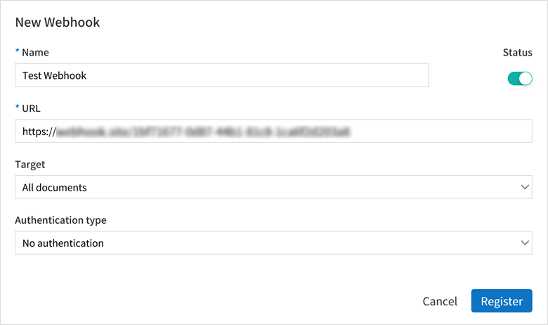
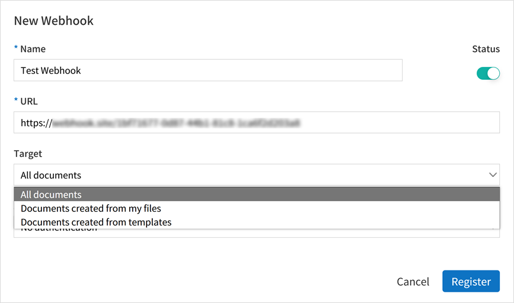
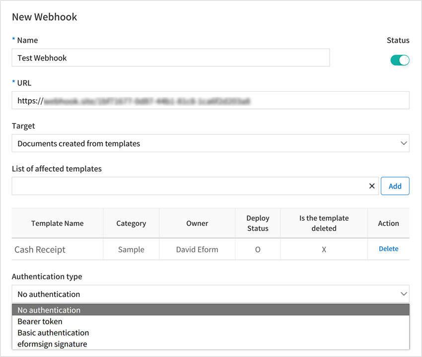
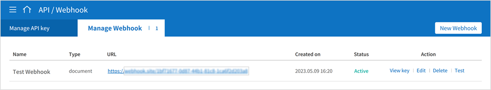
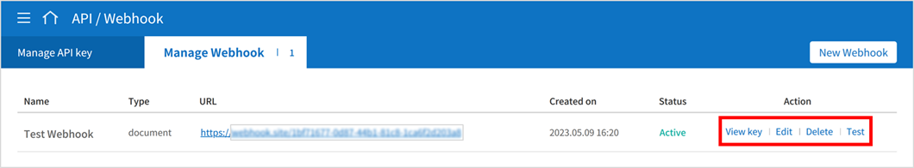
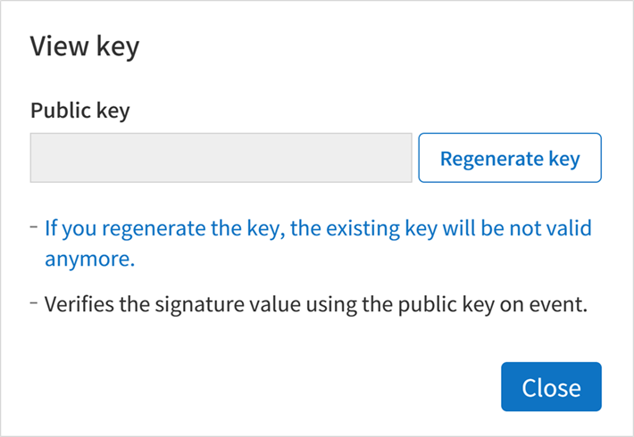
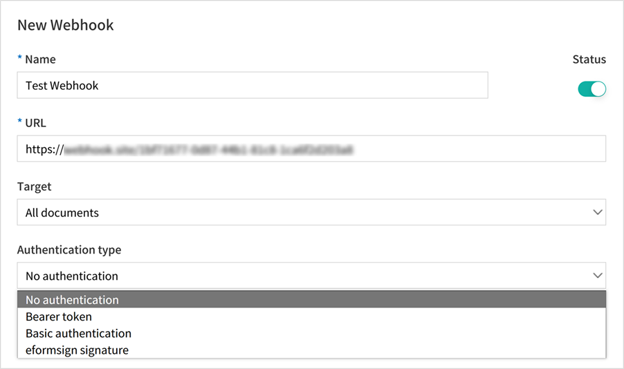
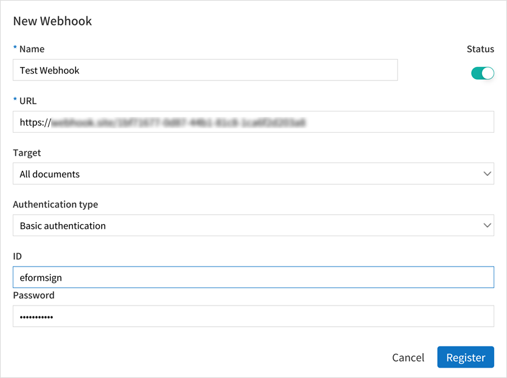

----------------------------
  Using eformsign Webhook
----------------------------

This is a feature that sends event information to the customer's system/service when an event occurs in eformsign. By configuring a webhook, event information is sent to the customer's webhook endpoint in the HTTP POST method.

.. tip:: 

    A Webhook endpoint refers to the customer's client callback URL. It allows you to get eformsign event information without making unnecessary calls, which differs from the Open API method where calls are continuously made to check for changes (polling).

Getting started
====================

.. _webhook:

Getting a webhook key
-------------------------------

1. Log in to eformsign as the company administrator and then go to **[Integration] > [API / Webhook]** in the sidebar menu.

.. image:: resources/apikey1.PNG
    :width: 700
    :alt: Integration > API/Webhook menu

2. Select the **[Manage Webhook]** tab and then click the **New Webhook** button.  

.. image:: resources/webhook2.PNG
    :width: 700
    :alt: New Webhook button

3. In the New Webhook pop-up, enter the Name, URL (endpoint URL), and choose the Status.

4. Select the **Target** documents. You can choose from **All documents, Documents created from my files, and documents created from templates**.

- **All documents:** Sends a webhook for all documents created in the company.
- **Documents created from my files:** Sends a webhook for documents created using **New from my file**.
- **Documents created from templates:** Send a webhook for documents created from a selected template.

.. note::

   You can select a template by following the instructions below.

   ① Click **List of affected templates** to view the list of templates and then select the template you want. Make sure to select a template (|image1|) here. Selecting a category (|image2|) instead will not add any templates.

    .. image:: resources/Webhook_select_template.png
        :width: 500
        :alt: New Webhook pop-up 3

   ② Select a template you want, and then click the **Add** button on the right.

    .. image:: resources/Webhook_add_popup.png
        :width: 500
        :alt: New Webhook pop-up 4

   ③ You can see that the selected template has been added to the **List of affected templates**\. You can add multiple templates this way.

    .. image:: resources/Webhook_add_popup2.png
        :width: 500
        :alt: New Webhook pop-up 5   

5. Select the **Authentication type**. You can select from one of **No authentication**, **Bearer token**, **Basic authentication**, and **eformsign signature**. For more information, refer to `Webhook authentication <#webhookauth>`_.

6. Click the **Register** button to add the webhook. You can view the webhook you added in the **Manage Webhook** tab.

Managing webhooks
--------------------

You can manage webhooks with the buttons on the right of each webhook.

Viewing a key
~~~~~~~~~~~~~~~

If you select **eformsign signature** for the **Authentication type**, you can view the public key for webhook authentication.
You can also regenerate the key by clicking the **Regenerate key** button. Note that regenerating a key means you cannot use the previous key.

If you select the **Authentication type** to anything other than **eformsign signature**, the public key will be left blank.

Editing a webhook
~~~~~~~~~~~~~~~~~~~~~
You can change the Name, URL, Status, Target, and Authentication type of a webhook by clicking the **Edit** button next to a webhook.

Deleting a webhook
~~~~~~~~~~~~~~~~~~~~~
You can delete a webhook by clicking the **Delete** button next to a webhook.

Testing a webhook
~~~~~~~~~~~~~~~~~~~~~
You can test a webhook by sending it to the configured webhook URL and return results.

The body of a test Webhook is as follows. Note that relevant data will be sent in the header according to the selected Authentication type.

.. code:: JSON

    {
      "webhook_id": "Webhook ID",
      "webhook_name": "Webhook name",
      "company_id": Company ID",
      "event_type": "document",
      "document": {
        "id": "test_doc_id",
        "document_title": "test_document_title",
        "template_id": "test_template_id",
        "template_name": "test_template_name",
        "workflow_seq": 0,
        "template_version": "1",
        "history_id": "test_document_history_id",
        "status": "doc_create",
        "editor_id": "User ID",
        "updated_date": "Current time (UTC Long)"
      }
    }

.. note::

   A pop-up message is displayed according to the test status as follows.

   **Upon successful send**: "Transmission test succeeded.""

   **Upon send failure**: "Transmission test failed.""

   **Upon send error or no response**: "A temporary error occurred. Please retry.""

.. _webhookauth:

Webhook authentication
========================

This is a feature that allows you to authenticate that the received webhook is a legitimate webhook called by eformsign. 

When adding or editing a Webhook, you can select one of the following authentication types.

- **No authentication**

Sends a webhook without any information for authentication. In this case, you can still see the event information, but you can't authenticate that the webhook received is a legitimate Webhook.

- **Bearer Token**

Uses the preset token value for authentication. When adding or editing a webhook, select **Bearer token** as the Authentication type and enter the value to be used as the token under **Value**.

In this case, the value will be included in the Authorization field of the request header when the webhook is sent.

.. image:: resources/Webhook_auth_type1.png
    :width: 500
    :alt:  Selecting a Webhook authentication type

For example, if you enter the test value as "bearer_test_value" as shown in the above image, you will see the following information in the header when the webhook is received. 

.. code:: JSON

    Authentication : Bearer bearer_test_value

This way, authentication can be done by extracting the token value from the header of the webhook and checking to see if it matches the preset value.

- **Basic Authentication**

Uses the ID and password for authentication. When adding or editing a webhook, select **Basic authentication** as the Authentication type and enter the ID and password to be used for authentication.

In this case, the value of the preset ID and password Base64-encoded in the form of **ID:password** will be included in the Authorization field of the request header when the webhook is sent.

For example, if you enter the ID and password as **eformsign** and **Webhook123!**, respectively, you will see the following information in the header when the webhook is received.

.. code:: JSON

    Authentication : Basic ZWZvcm1zaWduOldlYmhvb2sxMjMh

If you Base64 decode the value after Basic in the example above, you'll see **eformsign:Webhook123!**.

This way, authentication can be done by Base64 decoding the value that comes after Basic in the header of the Webhook checking to see if it matches the preset ID and password.

- **eformsign Signature**

Uses the eformsign Signature value for authentication.

.. note:: 

   eformsign_signature uses asymmetric key cryptography and elliptic curve cryptography, and uses the SHA256withECDSA algorithm.

When adding or editing a webhook, if you select **eformsign signature** as the Authentication type, the signature value will be included in the eformsign_signature field of the request header when the webhook is sent.

You can see an example of the header content as follows.

.. code:: JSON

    eformsign_signature : 3045022100b9f1e0cdd21492cb5fa16dabff4c4402bf3efb9a9741a40a0d1c70aeda24bc8c02204a57ca1abab288e968a799e2fecbf18de9ab59c7c5814144b17f32553640a71a

Sample code for signature authentication
------------------------------------------

After extracting the eformsign_signature value from the webhook's header, you can verify the signature by using the webhook's public key, which can be found by clicking the **View Key** button in the Webhook list, and the Request Body content of the incoming Webhook.

Java
~~~~~~~~~~~

Refer to the sample code provided in **Sample code by language**

Python
~~~~~~~~~~

You must use a library for key formatting. Install the library using the following command beforehand.

.. code:: python

   pip install https://github.com/warner/python-ecdsa/archive/master.zip

PHP
~~~~~~~~~

Make sure that the keycheck.inc.php and test.php files in the sample code below are placed in the same path before proceeding.

Sample code by language
~~~~~~~~~~~~~~~~~~~~~~~~~~~~

The following are the sample codes by language.

.. code-tabs::

    .. code-tab:: java
        :title: java

        import java.io.*;
        import java.math.BigInteger;
        import java.security.*;
        import java.security.spec.X509EncodedKeySpec;
         
         
        /**
         *  Reads the header and body in the request.
         *
         */
         
         
        //1. get eformsign signature
        //eformsignSignature is included in the request header.
        String eformsignSignature = request.getHeader("eformsign_signature");
         
         
        //2. get request body data
        // You must convert the body's data into string for authenticating the eformsign signature.
        String eformsignEventBody = null;
        StringBuilder stringBuilder = new StringBuilder();
        BufferedReader bufferedReader = null;
         
        try {
            InputStream inputStream = request.getInputStream();
            if (inputStream != null) {
                bufferedReader = new BufferedReader(new InputStreamReader(inputStream));
                char[] charBuffer = new char[128];
                int bytesRead = -1;
                while ((bytesRead = bufferedReader.read(charBuffer)) > 0) {
                    stringBuilder.append(charBuffer, 0, bytesRead);
                }
            }
         } catch (IOException ex) {
            throw ex;
         } finally {
            if (bufferedReader != null) {
                try {
                    bufferedReader.close();
                } catch (IOException ex) {
                    throw ex;
                }
            }
         }
        eformsignEventBody = stringBuilder.toString();
         
         
         
         
        //3. Setting up the publicKey
        String publicKeyHex = "Enter the public key you received here.";
        KeyFactory publicKeyFact = KeyFactory.getInstance("EC");
        X509EncodedKeySpec x509KeySpec = new X509EncodedKeySpec(new BigInteger(publicKeyHex,16).toByteArray());
        PublicKey publicKey = publicKeyFact.generatePublic(x509KeySpec);
         
        //4. verify
        Signature signature = Signature.getInstance("SHA256withECDSA");
        signature.initVerify(publicKey);
        signature.update(eformsignEventBody.getBytes("UTF-8"));
        if(signature.verify(new BigInteger(eformsignSignature,16).toByteArray())){
            //verify success
            System.out.println("verify success");
            /*
             * Event-specific processing is done here.
             */
        }else{
            //verify fail
            System.out.println("verify fail");
        }

    .. code-tab:: python
        :title: Python 3.9.6

        import hashlib
        import binascii
         
        from ecdsa import VerifyingKey, BadSignatureError
        from ecdsa.util import sigencode_der, sigdecode_der
        from flask import request
         
         
        # Reads the header and body in the request.
        # 1. get eformsign signature
        # eformsignSignature is included in the request header.
        eformsignSignature = request.headers['eformsign_signature']
         
         
        # 2. get request body data
        # Convert the body's data into string for verifying the eformsign signature.
        data = request.json
         
         
        # 3. Setting up the publicKey
        publicKeyHex = "Enter the public key you received here"
        publickey = VerifyingKey.from_der(binascii.unhexlify(publicKeyHex))
         
         
        # 4. verify
        try:
            if publickey.verify(eformsignSignature, data.encode('utf-8'), hashfunc=hashlib.sha256, sigdecode=sigdecode_der):
                print("verify success")
                # Event-specific processing is done here.
        except BadSignatureError:
            print("verify fail")

    .. code-tab:: php
        :title: PHP - keycheck.inc.php

        <?php
        namespace eformsignECDSA;
          
        class PublicKey
        {
          
            function __construct($str)
            {
                $pem_data = base64_encode(hex2bin($str));
                $offset = 0;
                $pem = "-----BEGIN PUBLIC KEY-----\n";
                while ($offset < strlen($pem_data)) {
                    $pem = $pem . substr($pem_data, $offset, 64) . "\n";
                    $offset = $offset + 64;
                }
                $pem = $pem . "-----END PUBLIC KEY-----\n";
                $this->openSslPublicKey = openssl_get_publickey($pem);
            }
        }
         
        function Verify($message, $signature, $publicKey)
        {
            return openssl_verify($message, $signature, $publicKey->openSslPublicKey, OPENSSL_ALGO_SHA256);
        }
        ?>

    .. code-tab:: php
        :title: PHP - test.php

        <?php
        require_once __DIR__ . '/keycheck.inc.php';
        use eformsignECDSA\PublicKey;
         
        define('PUBLIC_KEY', 'Enter the public key you received here');
         
        /*
         *  Reads the header and body in the request.
         *
         */
         
         
        //1. get eformsign signature
        //eformsignSignature is included in the request header.
        $eformsignSignature = $_SERVER['HTTP_eformsign_signature'];
         
         
        //2. get request body data
        // Reads the body's data for verifying eformsign signature.
        $eformsignEventBody = json_decode(file_get_contents('php://input'), true);
         
         
        //3. Setting up publicKey
        $publicKey = new PublicKey(PUBLIC_KEY);
         
         
        //4. verify
        $ret = - 1;
        $ret = eformsignECDSA\Verify(MESSAGE, $eformsignSignature, $publicKey);
          
        if ($ret == 1) {
            print 'verify success' . PHP_EOL;
            /*
             * Event specific processing is done here.
             */
        } else {
            print 'verify fail' . PHP_EOL;
        }
          
        ?>

.. _webhookevent:

Webhook events
====================

Setting up a webhook allows you to receive event information at the webhook URL you set when specific events occur in eformsign.

The current `Webhooks <https://app.swaggerhub.com/apis/eformsign_api.en/eformsign_API_2.0/Webhook-oas3#/Webhook/post-webhook>`_ provided are as follows.

Webhook event types
--------------------

Currently, eformsign sends webhooks for **Document events** and **PDF generation events**.

- **Document events:** These are events that occur when a document is generated or its status is changed in eformsign. The event_type is document and contains a document object.
- **PDF generation events:** These are events that occur when the PDF file of a document is generated in eformsign. The event_type is ready_document_pdf and contains a ready_document_pdf object.

Webhook structure
------------------

A webhook is sent to the webhook URL set by the user when a webhook event occurs.

The structure of the request body of the webhook sent is as follows.

.. table:: 

   =================== ====== ==================================== ===============================================
   Name                Type   Description                                   Remark
   =================== ====== ==================================== ===============================================
   webhook_id          String ID of Webhook that generated event
   webhook_name        String Name of Webhook that generated event
   company_id          String Company ID
   event_type          String Generated Webhook event type         document: document event

                                                                   ready_document_pdf: PDF generation event

   document            Object Document event's details             Only displayed at a document event generation
                                                                   (includes id, document_title, template_id, template_name, 
                                                                   workflow_seq, workflow_name, template_version, 
                                                                   history_id, status, editor_id, outside_token, 
                                                                   updated_date, and mass_job_request_id).

   ready_document_pdf  String Workflow name                        Only displayed at a PDF generation event
                                                                   (includes document_id, document_title, workflow_seq, 
                                                                   workflow_name, template_id, template_name,
                                                                   template_version, document_status, 
                                                                   document_history_id, export_ready_list, and 
                                                                   mass_job_request_id).

   =================== ====== ==================================== ===============================================

.. note::

    You can find more information about the eformsign webhook's structure and samples in `eformsign Webhook <https://app.swaggerhub.com/apis/eformsign_api.en/eformsign_API_2.0/Webhook-oas3#/Webhook/post-webhook>`_.

.. _status:

Document status code
----------------------

A webhook's request body contains a code that indicates the document status.

The document status code is shown in document.status and ready_document_pdf.document_status, for document events and PDF creation events, respectively.

The below tables describes each code.

.. table:: 

   ========================== ====================================
   Name                       Description
   ========================== ====================================
   doc_tempsave               Document saved as a draft 
   doc_create                 Document created   
   doc_request_participant    Document sent to a participant
   doc_accept_participant     Document approved by a participant
   doc_reject_participant     Document rejected by a participant
   doc_request_reviewer       Document sent a reviewer
   doc_accept_reviewer        Document approved by a reviewer
   doc_reject_reviewer        Document rejected by a reviewer
   doc_reject_request         Document requested to be declined
   doc_decline_cancel_request Document decline request rejected
   doc_delete_request         Document requested to be deleted   
   doc_decline_delete_request Document deletion request rejected
   doc_cancel_request         Document approval request cancelled
   doc_deleted                Document deleted
   doc_request_approval       Document approval requested (legacy workflow)
   doc_accept_approval        Document approval request approved (legacy workflow)
   doc_reject_approval        Document approval request declined (legacy workflow)
   doc_request_external       Document sent to an external recipient (legacy workflow)
   doc_remind_external        Document resent to an external recipient (legacy workflow)
   doc_open_external          Document opened by an external recipient (legacy workflow)
   doc_accept_external        Document reviewed by an external recipient (legacy workflow)
   doc_reject_external        Document declined by an external recipient (legacy workflow)
   doc_request_internal       Document sent to an internal recipient (legacy workflow)
   doc_accept_internal        Document reviewed by an internal recipient (legacy workflow)
   doc_reject_internal        Document declined by an internal recipient (legacy workflow)
   doc_tempsave_internal      Document saved as a draft by an internal recipient(legacy workflow)
   doc_complete               Document completed
   ========================== ====================================

.. |image1| image:: resources/template_icon.png
.. |image2| image:: resources/category_icon.png
